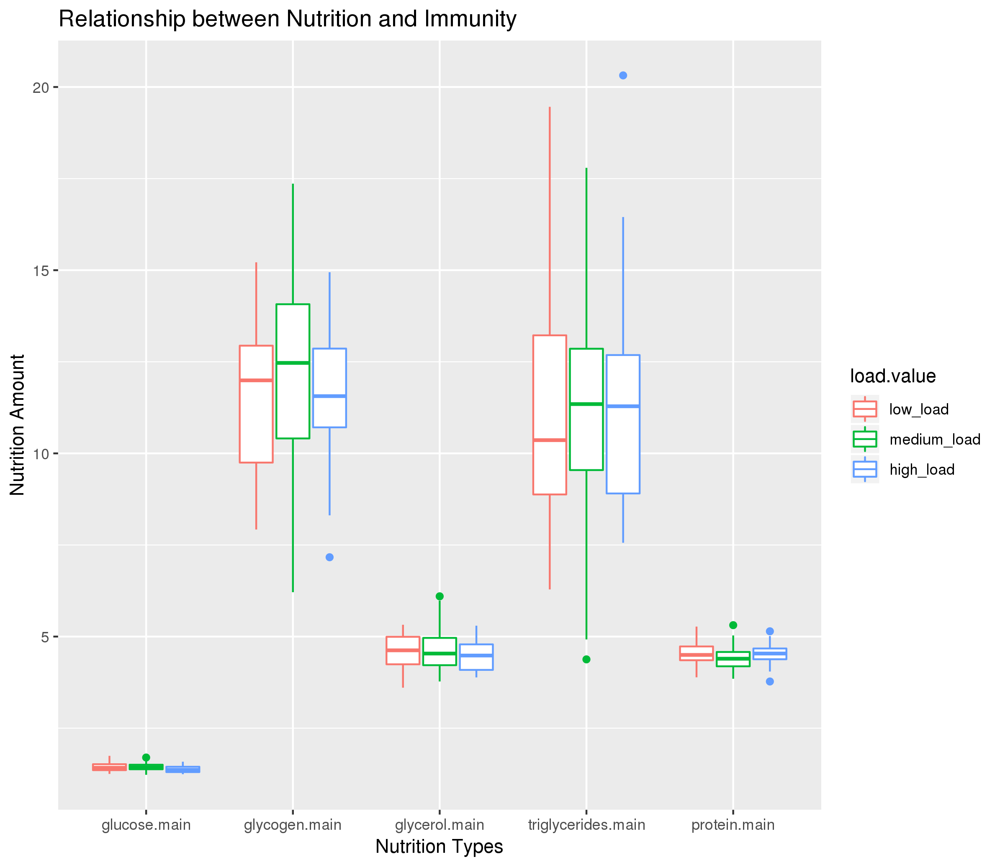
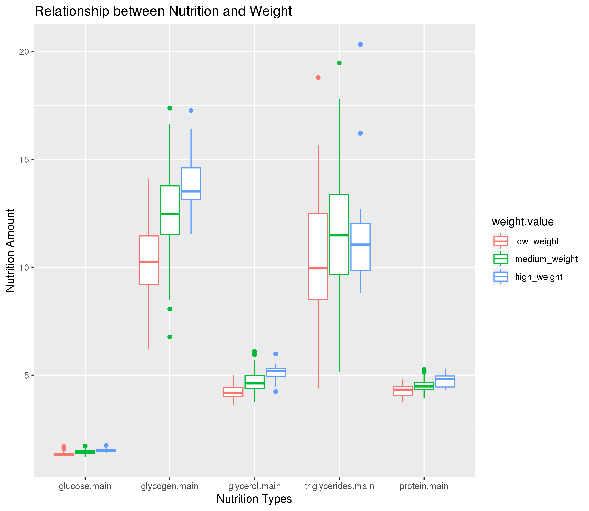
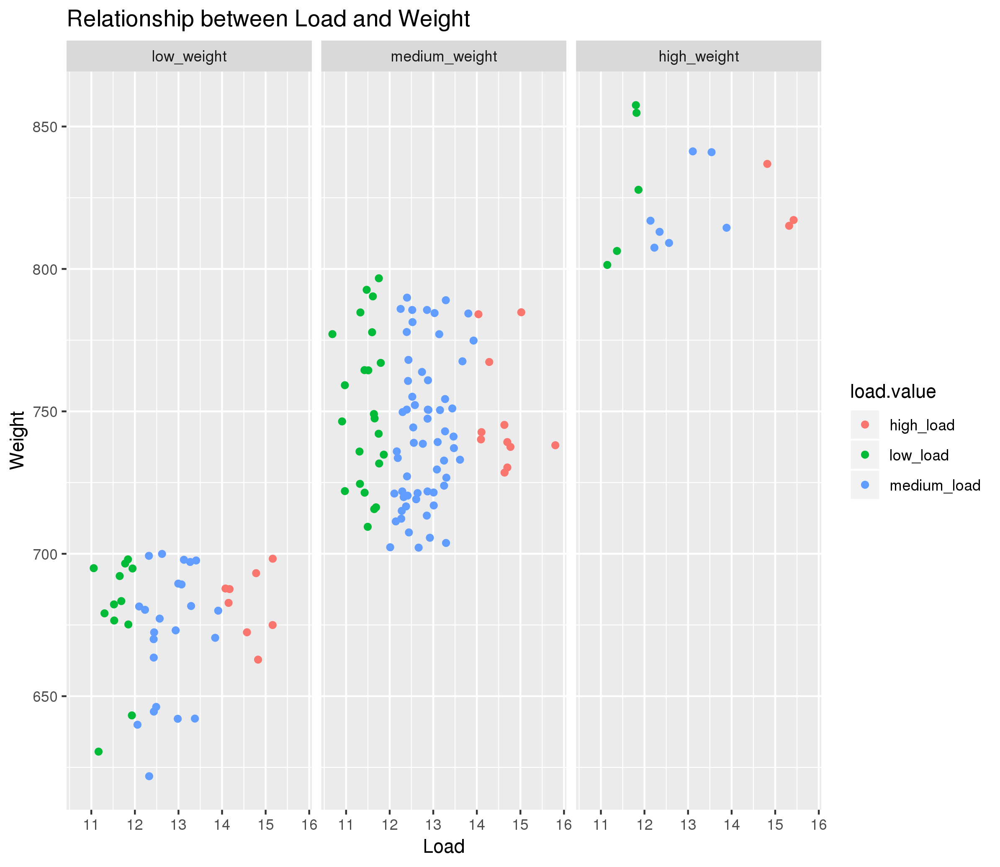

# Data summary by M. Wiltsie

## Overview of data
I used data from https://datadryad.org/bitstream/handle/10255/dryad.79667/allnutrients.csv which describes the different nutrition, weights, and bacterial loads of drosophila melanogaster (flies).

## Q1: Is there a correlation between nutrition type (glucose, glycogen, glycerol, triglycerides) & amount and immunity of the fly, as measured by bacterial load?

###Melt the variables for the different nutrition types together
flies2 <- melt(flies, measure.vars = c("glucose.main", "glycogen.main", "glycerol.main", "triglycerides.main", "protein.main"))

###Subset the columns for immunity to make 3 new categories of low, medium, and high immunity, and then order them so later they appear in that order
flies2[load.main < 12, load.value := "low_load"]
flies2[load.main >= 12 & load.main < 14, load.value := "medium_load"]
flies2[load.main >= 14, load.value := "high_load"]
flies2[,load.value := factor(load.value, levels = c("low_load", "medium_load", "high_load"))]

###Generate a box plot to see the relationship, and save the plot
ggplot(flies2, aes(x = variable, y = value, color = load.value)) + geom_boxplot() +  xlab("Nutrition Types") + ylab("Nutrition Amount") + ggtitle("Relationship between Nutrition and Immunity")

Q1 <- ggplot(flies2, aes(x = variable, y = value, color = load.value)) + geom_boxplot() +  xlab("Nutrition Types") + ylab("Nutrition Amount") + ggtitle("Relationship between Nutrition and Immunity")

ggsave('Relationship between Nutrition and Immunity.png', Q1)

*Interpreation*: The data show that there does not appear to be a significant relationship between amount of nutrition or type of nutrition and immunity. For each nutrition type, as indicated on the x axis, there is no large difference in the nutrition amount value on the y axis for low, medium, and high load.

### Q2: Is there a correlation between nutrition type (glucose, glycogen, glycerol, and triglycerides) & amount and fly weight?

###Subset the weight column to create 3 new categories: low, medium, and high weight, and order them as such
flies2[meanweight.main < 700, weight.value := "low_weight"]
flies2[meanweight.main >= 700 & meanweight.main < 800, weight.value := "medium_weight"]
flies2[meanweight.main >= 800, weight.value := "high_weight"]

flies2[,weight.value := factor(weight.value, levels = c("low_weight", "medium_weight", "high_weight"))]

###Generate a box plot to view the relationship, and save the graph
ggplot(flies2, aes(x = variable, y = value, color = weight.value)) + geom_boxplot() +  xlab("Nutrition Types") + ylab("Nutrition Amount") + ggtitle("Relationship between Nutrition and Weight")

Q2 <- ggplot(flies2, aes(x = variable, y = value, color = weight.value)) + geom_boxplot() +  xlab("Nutrition Types") + ylab("Nutrition Amount") + ggtitle("Relationship between Nutrition and Weight")

ggsave('Relationship between Nutrition and Weight.png', Q2)

*Interpreation*: The data show that for each type of nutrition, as the amount consumed increases, so does the weight of the fly. Each nutrition type, as indicated by the x axis, shows increasing nutrition amount for low, medium, and high weight flies.

## Q3: Is there a relationship between load and weight?

###Use the non-melted data, and subset the load column and the weight column by the same standards used in the previous questions for the melted data
flies[load.main < 12, load.value := "low_load"]
flies[load.main >= 12 & load.main < 14, load.value := "medium_load"]
flies[load.main >= 14, load.value := "high_load"]

flies[meanweight.main < 700, weight.value := "low_weight"]
flies[meanweight.main >= 700 & meanweight.main < 800, weight.value := "medium_weight"]
flies[meanweight.main >= 800, weight.value := "high_weight"]

###Order the new weight categories to appear in the following order: low, medium, high
flies[,weight.value := factor(weight.value, levels = c("low_weight", "medium_weight", "high_weight"))]

###Generate a scatter plot, excluding the columns that were missing data, and save the graph
ggplot(flies[!is.na(load.main) & !is.na(meanweight.main) & !is.na(load.value) & !is.na(weight.value)], aes(x = load.main, y = meanweight.main, color = load.value)) + geom_point() + facet_wrap(vars(weight.value)) + xlab("Load") + ylab("Weight") + ggtitle("Relationship between Load and Weight")

Q3 <- ggplot(flies[!is.na(load.main) & !is.na(meanweight.main) & !is.na(load.value) & !is.na(weight.value)], aes(x = load.main, y = meanweight.main, color = load.value)) + geom_point() + facet_wrap(vars(weight.value)) + xlab("Load") + ylab("Weight") + ggtitle("Relationship between Load and Weight")

ggsave('Relationship between Load and Weight.png', Q3)

*Interpreation*: The data show that there does not appear to be a significant relationship between bacterial load and weight of drosophila melanogaster. There is an equal distribution of low, medium, and high load in each of the weight categories.
