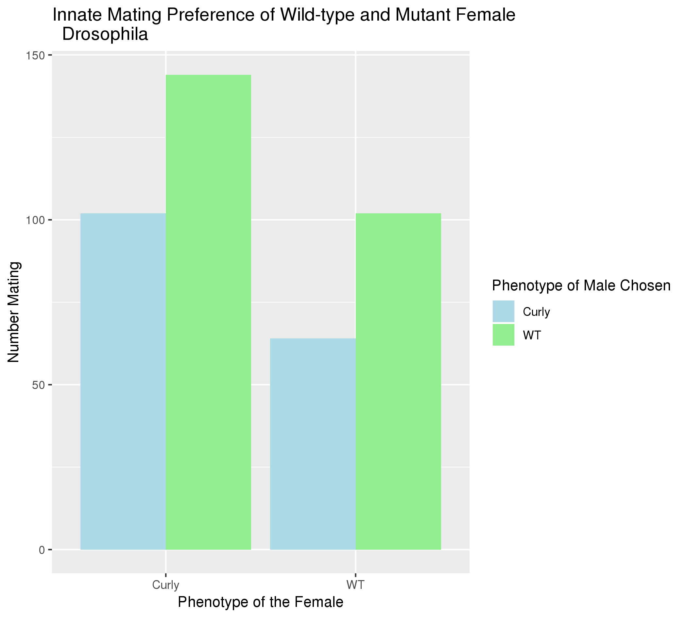
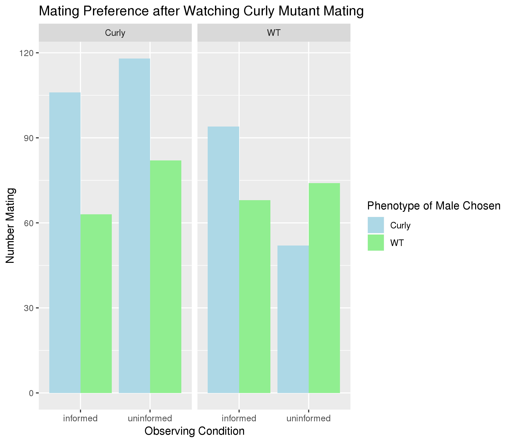
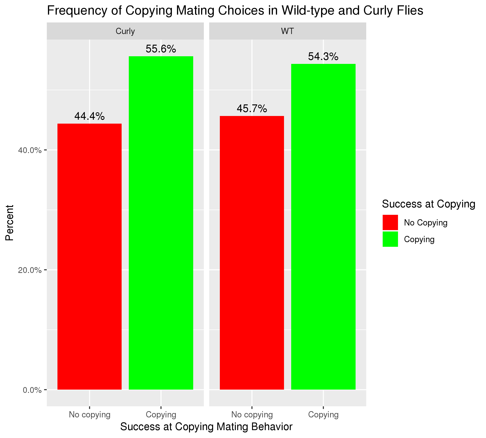

# Data Summary by Ashley Ewing

## Overview of Data
I used data from https://datadryad.org/bitstream/handle/10255/dryad.182697/Data-set%20Mate-copying%20of%20a%20costly%20variant%20.xlsx which describes Drosophila mating preferences between wild-type and Curly mutant flies when they are observing mating occurring between two flies before they mate themselves. The researchers wanted to know if the females would copy the behavior they observed even if it meant mating with a mutant, in this case, the Curly mutant.

## Q1: Do female Drosophila naturally prefer mating with wild-type or Curly mutant flies?

**Interpretation**: This plot shows that both curly and wild-type female Drosophila prefer to mate with wild-type flies because the number of mating choices made for wild-type was higher than choosing Curly in both female phenotypes. It is interesting that even the curly mutant female flies prefer wild-type over the male flies that have the same mutation as them, curly. This may be because mating with curly mutants would be a fitness cost and result in offspring that are less healthy than wild-type.

## Q2 Does watching Curly Flies Mating Change Female Drosophila Preference?

**Interpretation**: This plot shows the mating preference of female Curly and wild-type Drosophila after watching Curly mutants copulate (mate) with another female. The informed females observed this copulation, while the uninformed did not. This plot shows that among both Curly and wild-type flies, after watching copulation with a Curly mutant (the informed groups), the females preferred mating with Curly flies over wild-type. However, in the uninformed Curly group, we would expect that the preference would be for wild-type, as shown in the previous figure, but instead we see a preference for curly as well. The change in preference after watching copulation with Curly flies is only seen in wild-type flies. In the uninformed group, the flies prefer mating with wild-type, while in the informed group, the flies prefer mating with Curly. This shows that the wild-type flies are exhibiting mate-copying, in which they copy the mating behavior of other flies.

## Q3 Does the success of copying mating behavior vary with phenotype of the observing female?

**Interpretation**: This plot shows the success of the curly and wild-type flies copying the mating behavior they observe (mating with curly or wild-type flies). A "Success" at copying is when the observer female chooses to mate with the same male phenotype that she observed mating, while no copying is when the observer female chooses the opposite male to mate with. As shown in this plot, there is not a significant difference between the wild-type and curly mutants ability to copy the mating choices of what they observe. Additionally, just over half of the mating choices for both types of flies are the same as what they observed, indicating that there is some mate-copying present, but it may not be very significant.  

## Overall Conclusions
1. Wild-type and Curly mutant flies naturally prefer mating with wild-type flies over Curly mutants.
2. Wild-type flies and Curly mutant flies both tend to copy the mating choices that they observe to an approximately equal extent.
3. The wild-type preference for wild-type flies over Curly can be reversed by having the flies observe mating with Curly flies.

# Works Cited
Nöbel S, Danchin E, Isabel G (2018) Mate-copying for a costly variant in Drosophila melanogaster females. Behavioral Ecology 29(5): 1150-1156. https://doi.org/10.1093/beheco/ary095

Nöbel S, Danchin E, Isabel G (2018) Data from: Mate-copying for a costly variant in Drosophila melanogaster females. Dryad Digital Repository. https://doi.org/10.5061/dryad.739h56c
