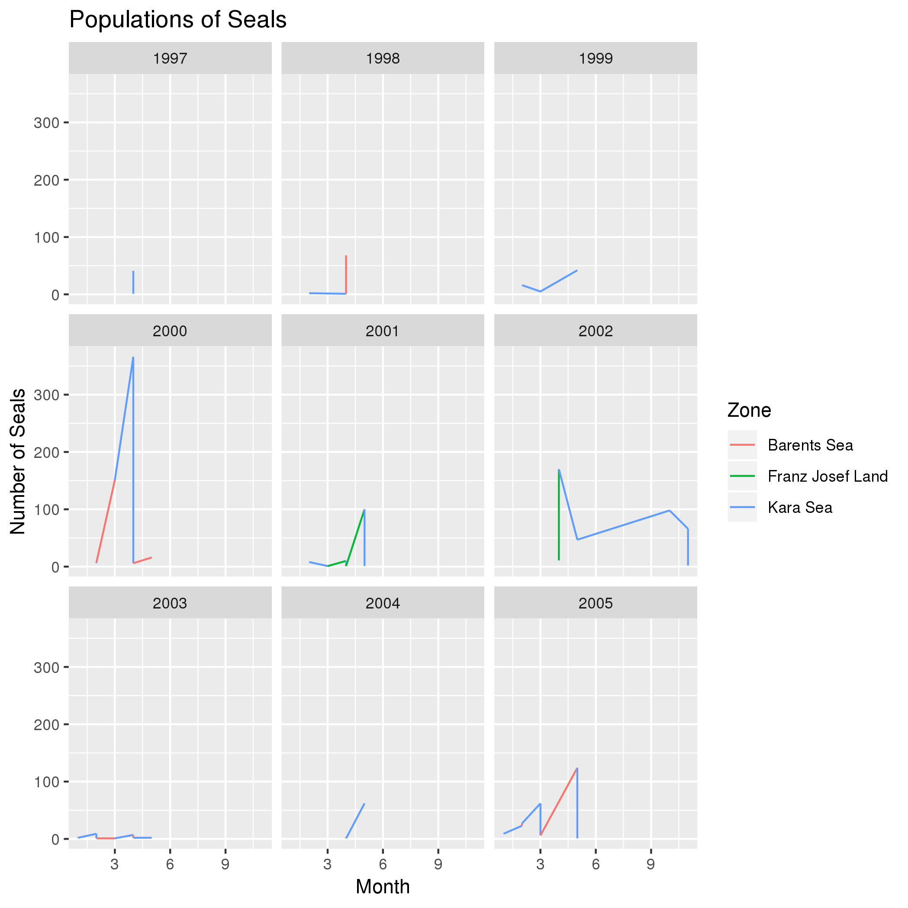
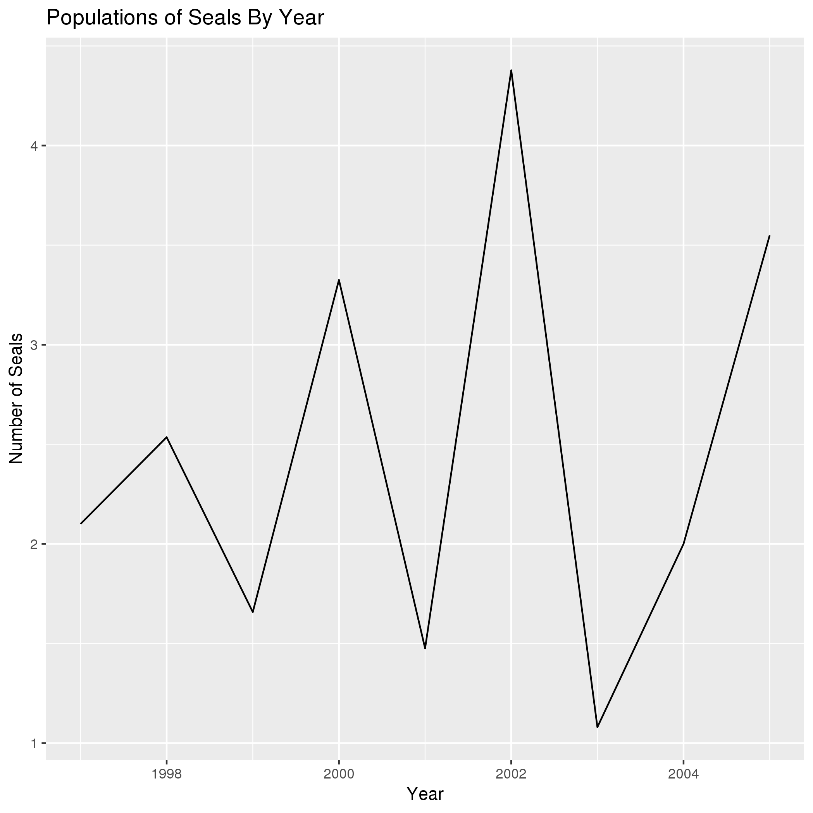
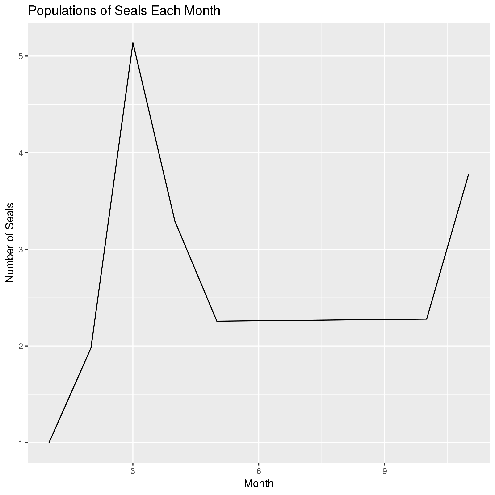

# Data summary by Breanna Raymond

**SEALS!** In this activity you will explore the populations of seals overtime.

## Overview of data
I used data from https://datadryad.org/bitstream/handle/10255/dryad.178573/GIS_species_data.zip which describes the population density of seals over time.

## Q1: How do seal populations over time compare in each zone?

*Interpreation*: The data show that ... blah blah blah.

## Q2: Does ... vary with variable ?

*Interpreation*: The data show that ... blah blah blah.

## Q3: Does ... over time .. ?

*Interpreation*: The data show that ... blah blah blah.
