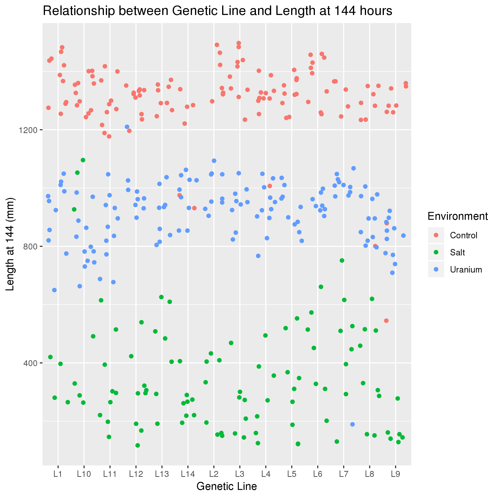

# Data summary by C. Margraf

## Overview of data
I used data from https://datadryad.org/bitstream/handle/10255/dryad.78937/Lines_data.csv which describes the fecundity, length, and survival for different populations of C. elegans under saline, uranium, or natural (control) conditions.

## Downloading Data and Installing Appropriate Packages in R
wget https://datadryad.org/bitstream/handle/10255/dryad.78937/Lines_data.csv
mv Lines_data.csv fecund.csv
### Load into R

module load gcc
module load R/3.5.1
R

### Install Necessary Packages

install.packages("data.table")
install.packages("ggplot2")
library(ggplot2)
library(data.table)

### Name the data file

fecund <- fread("fecund.csv")

## Q1: Does the nematodes' fecundity depend on their environment?

```
ggplot(fecund,
  aes(x = Fecundity, y = Environment, color = Line)) + geom_jitter() +
  ggtitle("Relationship between Fecundity, Enivronment, and Genetic Line") +
  xlab("Fecundity (Number of larvae produced)")

Q1 <- ggplot(fecund,
  aes(x = Fecundity, y = Environment, color = Line)) + geom_jitter() +
  ggtitle("Relationship between Fecundity, Enivronment, and Genetic Line") +
  xlab("Fecundity (Number of larvae produced)")

ggsave('Q1.png', Q1)
```


*Interpreation*: When looking at the data above, it is known that the nematodes produce the most larvae in the control environment, followed by the uranium environment, and finally, they produce the least larvae in the saline environment. Additionally, the third dimension of the plot show the different genetic lines used in the experiment, and there is no correlation between the line and survival in a particular environment. This is evident by the random scattering of color in each environmental condition.


## Q2: Does the nematodes' fecundity correlate with their length at 72 hours?

```
ggplot(fecund,
  aes(x = `Length (72h)`, y = Fecundity, color =Environment))+
  geom_jitter() +
  ggtitle("Relationship between Fecundity and Length at 72 hours") +
  xlab("Fecundity (Number of larvae produced)") +
  ylab("Length at 72h (mm)")

Q2 <- ggplot(fecund,
  aes(x = `Length (72h)`, y = Fecundity, color =Environment))+
  geom_jitter() +
  ggtitle("Relationship between Fecundity and Length at 72 hours") +
  xlab("Fecundity (Number of larvae produced)") +
  ylab("Length at 72h (mm)")
ggsave('Q2.png', Q2)
```


*Interpreation*: This data shows that the two variables do indeed correlate and show that the as fecundity increases, as does the nematodes length at 72 hours. Additionally, the the control produces both the highest fecundity, while the two experimental conditions, uranium and salt, produce the descending amounts of both, in that order.


## Q3: Does the nematodes' fecundity correlate with their length at 144 hours?

```
ggplot(fecund,
  aes(x = `Length (144h)`, y = Fecundity, color =Environment))+
  geom_jitter() +
  ggtitle("Relationship between Fecundity and Length at 144 hours") +
  xlab("Fecundity (Number of larvae produced)") +
  ylab("Length at 144 (mm)")

Q3 <- ggplot(fecund,
  aes(x = `Length (72h)`, y = Fecundity, color =Environment))+
  geom_jitter() +
  ggtitle("Relationship between Fecundity and Length at 144 hours") +
  xlab("Fecundity (Number of larvae produced)") +
  ylab("Length at 144h (mm)")

ggsave('Q3.png', Q3)
```


*Interpreation*: This data is very similar to the 72 hour data, however, the difference between the three groups is even more drastic. Length and Fecundity both increase with more favorable environments, however, there seem to be a few outliers from the salt group at the bottom of the control group. These survivors from the 72 hour timepoint may have a genetic advantage.


## Q3: Does the nematodes' genetic line correlate with their length and fecundity at 144 hours?

```
ggplot(fecund,
  aes(x = Line, y = `Length (144h)`, color = Environment))+
  geom_jitter() +
  ggtitle("Relationship between Genetic Line and Length at 144 hours") +
  xlab("Genetic Line") +
  ylab("Length at 144 (mm)") ```

Q4 <- ggplot(fecund,
  aes(x = Line, y = `Length (144h)`, color = Environment))+
  geom_jitter() +
  ggtitle("Relationship between Genetic Line and Length at 144 hours") +
  xlab("Genetic Line") +
  ylab("Length at 144 (mm)")
ggsave('Q4.png', Q4)
```



```
ggplot(fecund,
  aes(x = Line, y = Fecundity, color = Environment))+
  geom_jitter() +
  ggtitle("Relationship between Genetic Line and Fecundity") +
  xlab("Genetic Line") +
  ylab("Fecundity (number of larvae produced)") ```

Q5 <- ggplot(fecund,
  aes(x = Line, y = Fecundity, color = Environment))+
  geom_jitter() +
  ggtitle("Relationship between Genetic Line and Fecundity") +
  xlab("Genetic Line") +
  ylab("Fecundity (number of larvae produced)") ```

ggsave('Q5.png', Q5)
```


*Interpreation*: This data proves the suspicion that was had in the last graphs. While it did not originally seem like any of the genetic lines had any predisposition to surviving better in any one condition, Line 10 does, in fact, survive better in the saline conditions than any other line.
