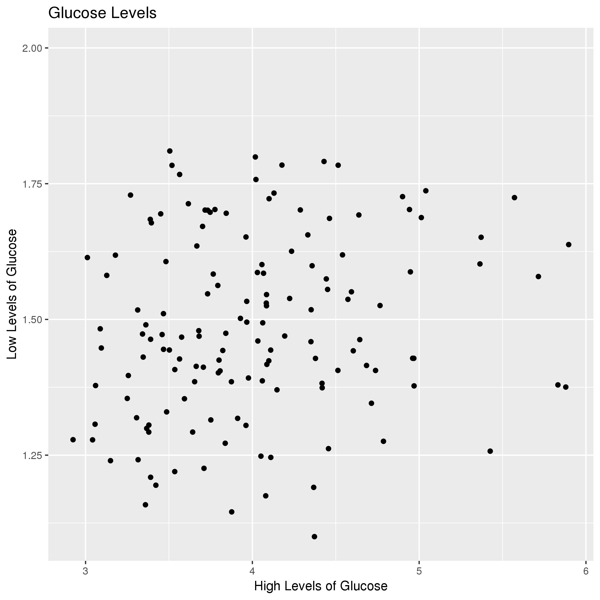
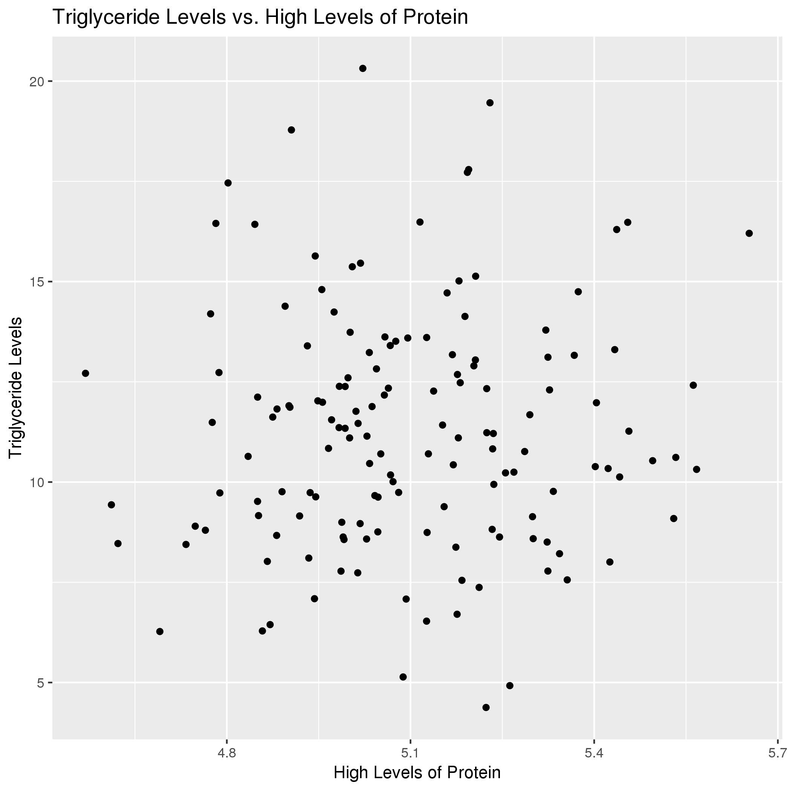
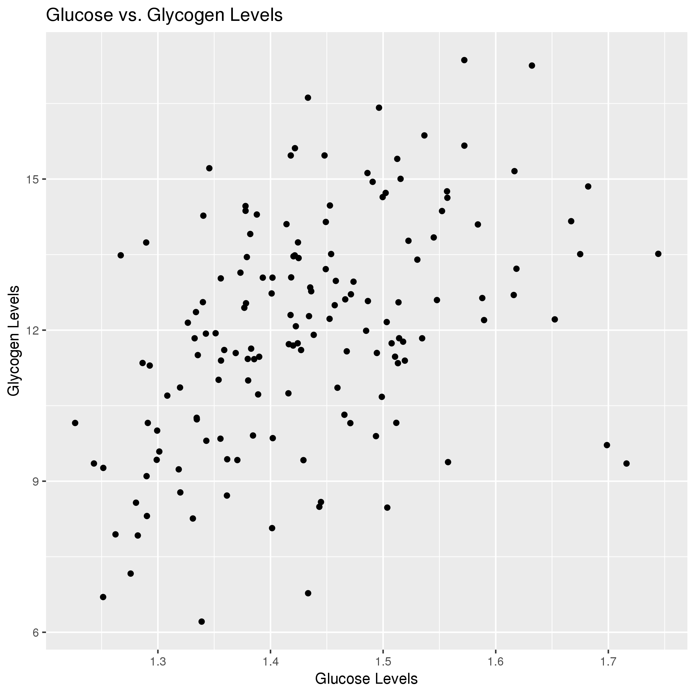

# Data summary by Cassidy Kelly

**Note**: BIOL4585_project

## Overview of data
I used data from https://datadryad.org/bitstream/handle/10255/dryad.79667/allnutrients.csv?sequence=1
 which describes Mean phenotype values for various DGRP (drosophila melanogaster) lines. The complex contributions of genetics and nutrition to immunity in Drosophila melanogaster.

## Q1: Does Low levels of Glycogen correlate with High levels of Glucose?

*Interpretation*: The data show that their exist small positive correlation among low levels of glycogen and high levels of glucose.This shows that the insulin receptors are working in Drosophila species.

## Q2: Does High Levels of Protein vary with Triglyceride Levels ?

*Interpretation*: The data show that does not exist any correlation among Triglyceride and Protein Levels.

## Q3: Describe the relationship between Nutrition Type and value obtained ?

*Interpretation*: The data show that Glycogen and Triglycerides provide high nutritional content. Biologically this conclusion makes sense because glycogen serves as a form of storage and triglycerides are the main constituents of body fat in organisms.
