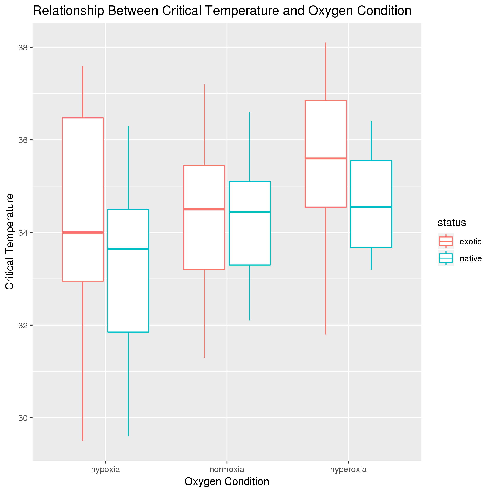
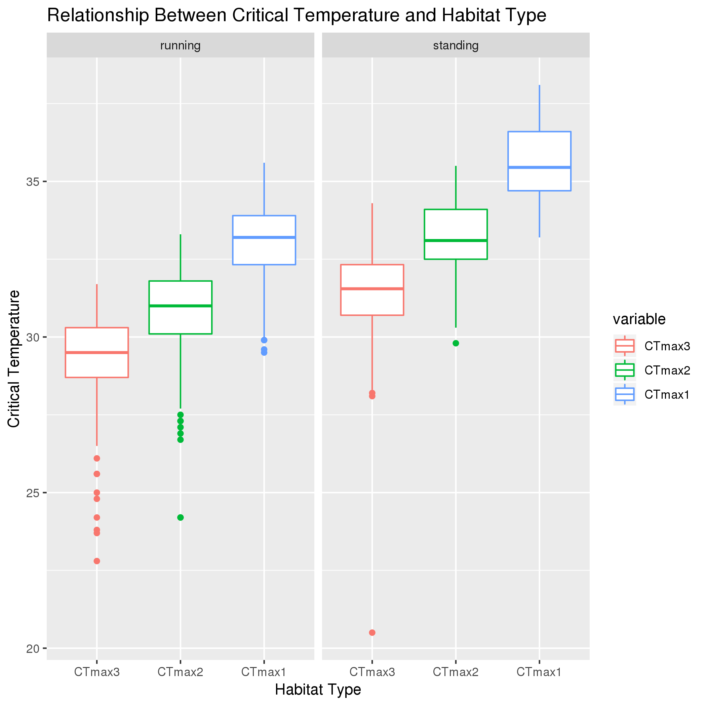
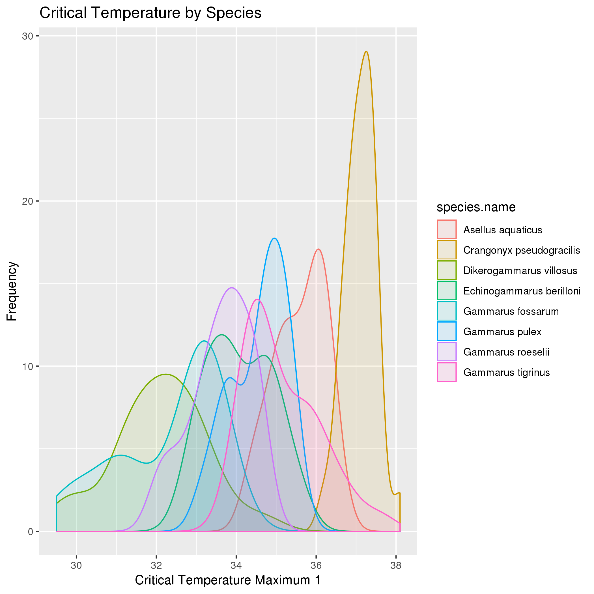

# Data summary by Danielle Triebwasser

## Data Overview
This dataset was retrieved from https://datadryad.org/bitstream/handle/10255/dryad.168233/FE_datfile_TTolerance.csv?sequence=1. The data explores the thermal limits of four native and four alien peracarid Crustacean species in different oxygen conditions and habitats.

## Q1: Does thermal tolerances vary between native and alien freshwater species relative to oxygen conditions?

*Interpreation*: The data suggests that there is a difference in thermal tolerances between hypoxic (5kPa), normoxic (20kPa), and hyperoxic conditions (60kPa). Higher oxygen concentrations are associated with higher critical temperatures, for both native and exotic crustacean species. Differences in thermal tolerances between native and exotic species are most pronounced in the hypoxic condition, and the least distinct in the normoxic condition.

Note: For this analysis Critical Temperature 1 (CTmax1) was used for analysis: the temperature where a subject demonstrated either no movement or was pronounced dead.

## Q2: Does thermal tolerance vary according to preferred habitat?

Critical Temperature 1 (CTmax1): no movement/death
Critical Temperature 2 (CTmax2): no undulation
Critical Temperature 3 (CTmax3): intermittent/irregular undulation

*Interpreation*: The boxplot suggests that there is difference in thermal tolerances between running and standing water conditions. In running water, critical temperatures increase as conditions progress from CTmax3 to CTmax2 and finally CTmax1. While the same increasing pattern is observed in standing water, the thermal tolerances in this condition are consistently higher for each of the respective critical temperatures.

## Q3: Do thermal tolerances vary by Crustacean species?

*Interpreation*: Critical temperature does vary according to individual Crustacean species. Each species demonstrates a distinct thermal tolerance range at variable overall frequencies. Each species overlaps with the thermal tolerance of at least two other species. Further investigation with additional Crustacean species and environmental conditions is required. 

Note: CTmax1 was used for analysis. Exotic species: *Dikerogammarus villosus, Echinogammarus berilloni, Crangonyx pseudogracilis*, and *Gammarus tigrinus*. Native species: *Gammarus fossarum, Gammarus roeselii, Asellus aquaticus*, and *Gammarus pulex*.

##Citation

Verberk WCEP, Leuven RSEW, van der Velde G, Gabel F (2018) Thermal limits in native and alien freshwater peracarid Crustacea: The role of habitat use and oxygen limitation. Functional Ecology 32(4): 926-936. https://doi.org/10.1111/1365-2435.13050

Verberk WCEP, Leuven RSEW, van der Velde G, Gabel F (2018) Data from: Thermal limits in native and alien freshwater peracarid Crustacea: the role of habitat use and oxygen limitation. Dryad Digital Repository. https://doi.org/10.5061/dryad.tf641
