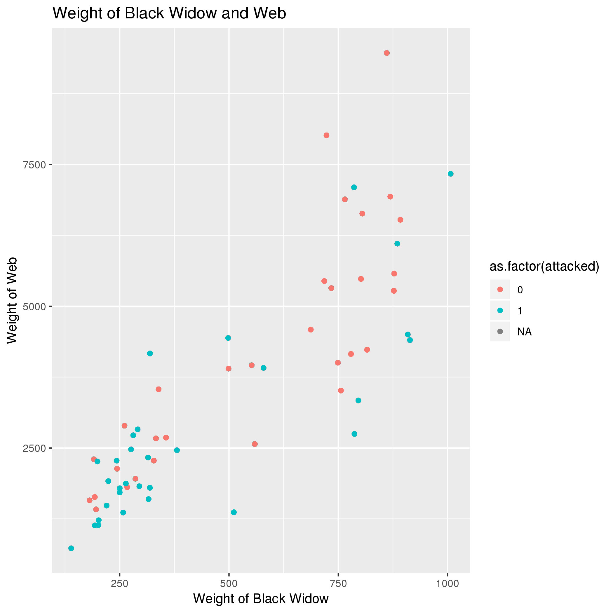
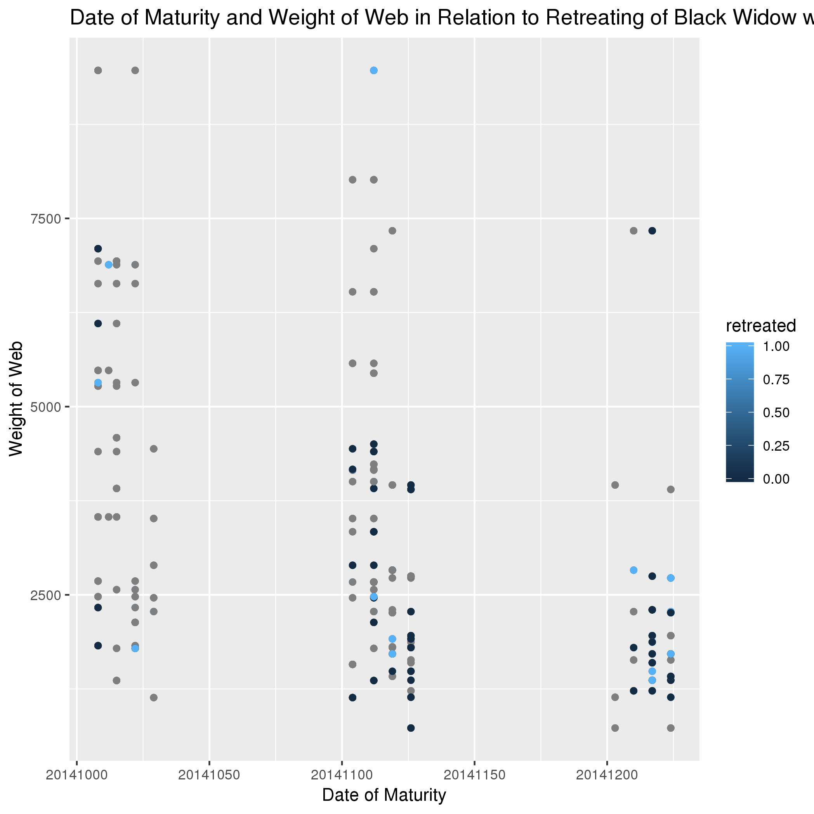
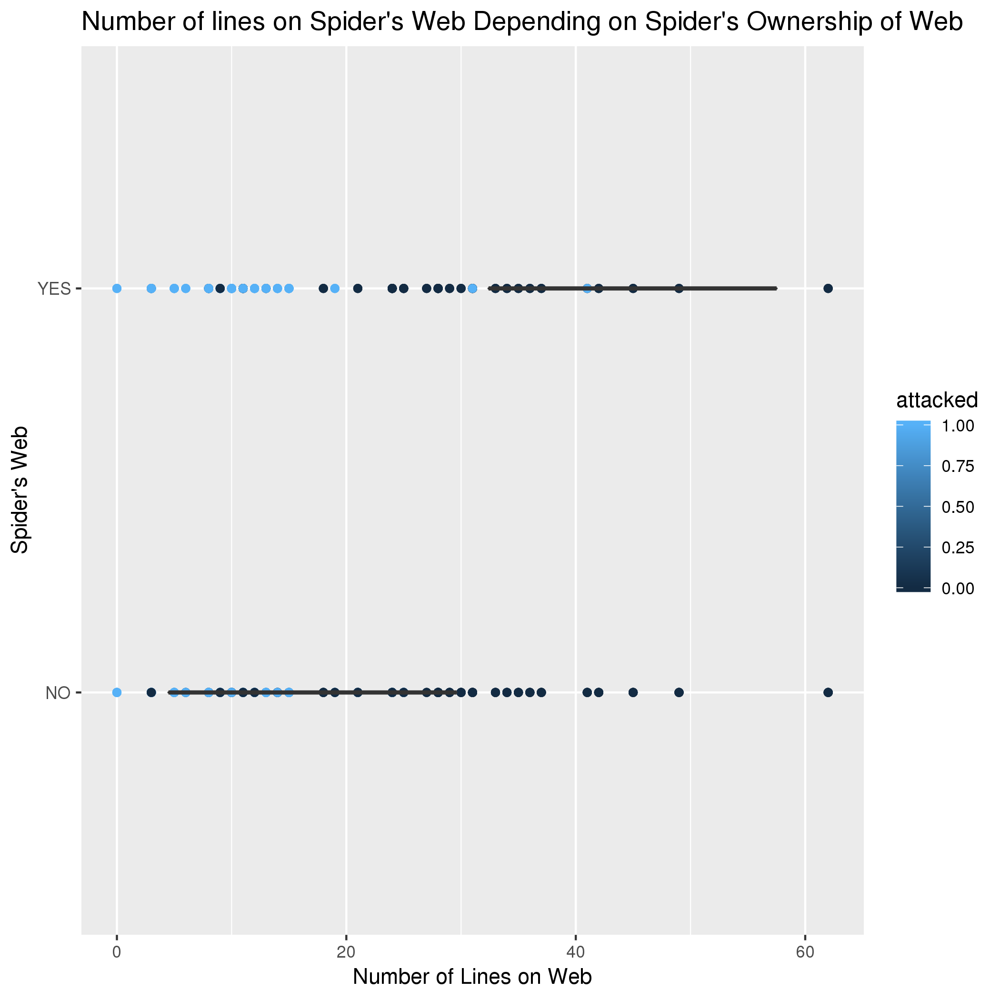

# Data Summary by Daniel Song

**Overview of Data**
I used data from https://datadryad.org/resource/doi:10.5061/dryad.ng4b0

**Q1: Does Weight of Spider correlate with Weight of Web?**

*Interpretation:*
This graph displays that there is a positive correlation between the weight of the spider and the weight of the web.  As the spiders weight increases so did the weight of the web. 

**Q2: How does the date of maturity of Black Widows influence the weight of the web?**

*Interpretation:*
The graph displays that there is not much of a relation between the date of maturity and the weight of the web. 

**Q3: Do Black Widows create more web lines if they are on a web they created?**

*Interpretation:*
The graph displays that there is an increase in web lines created if the spider is on their own web. 
