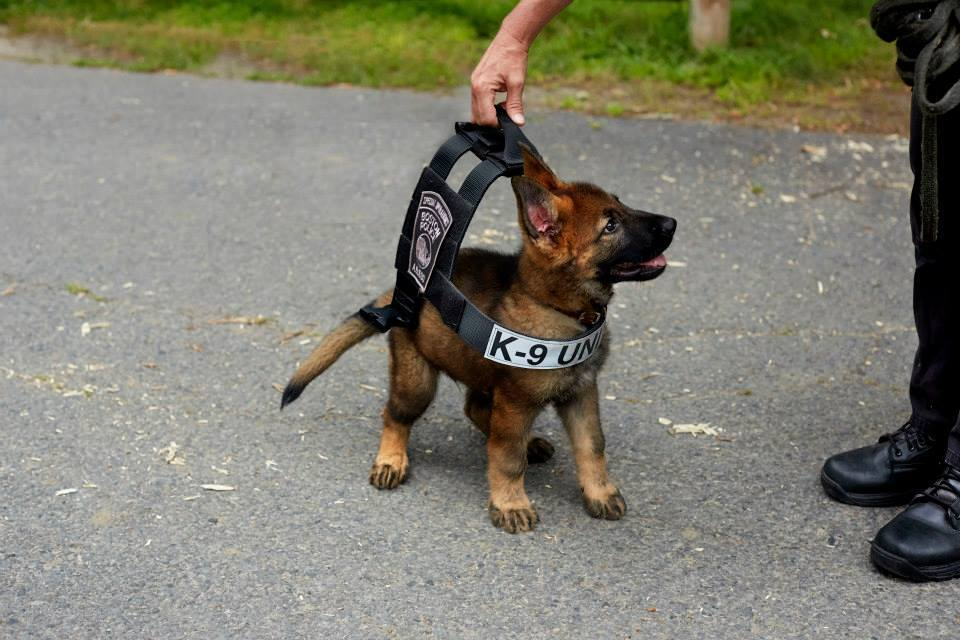
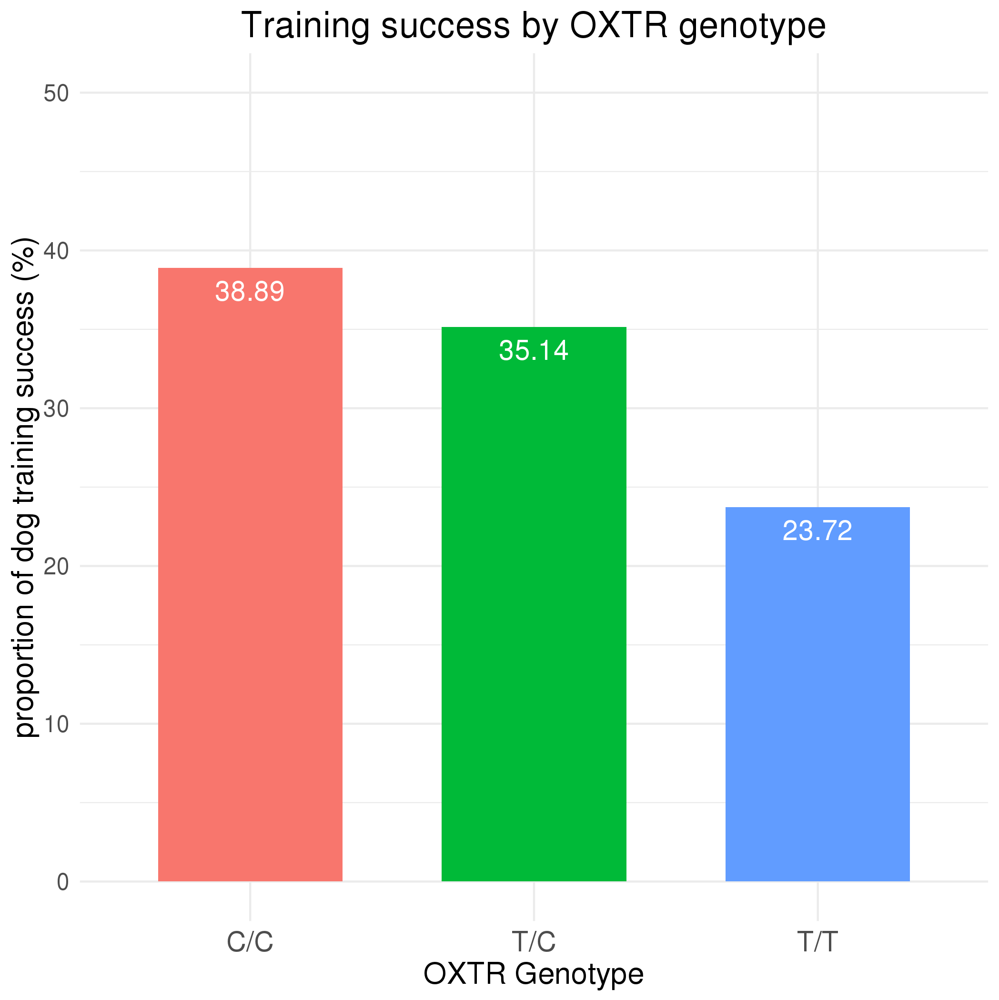
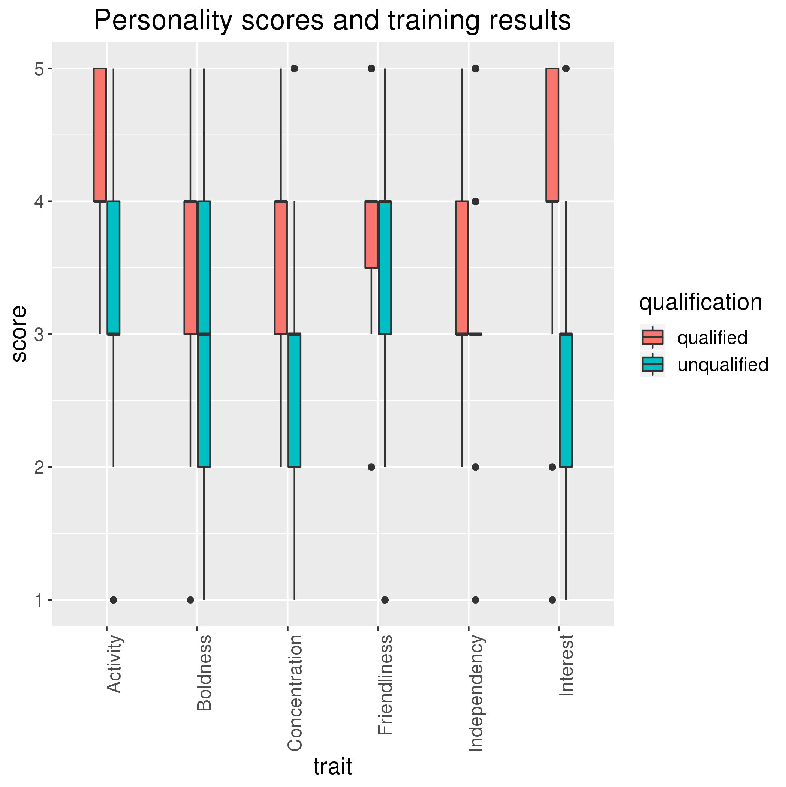
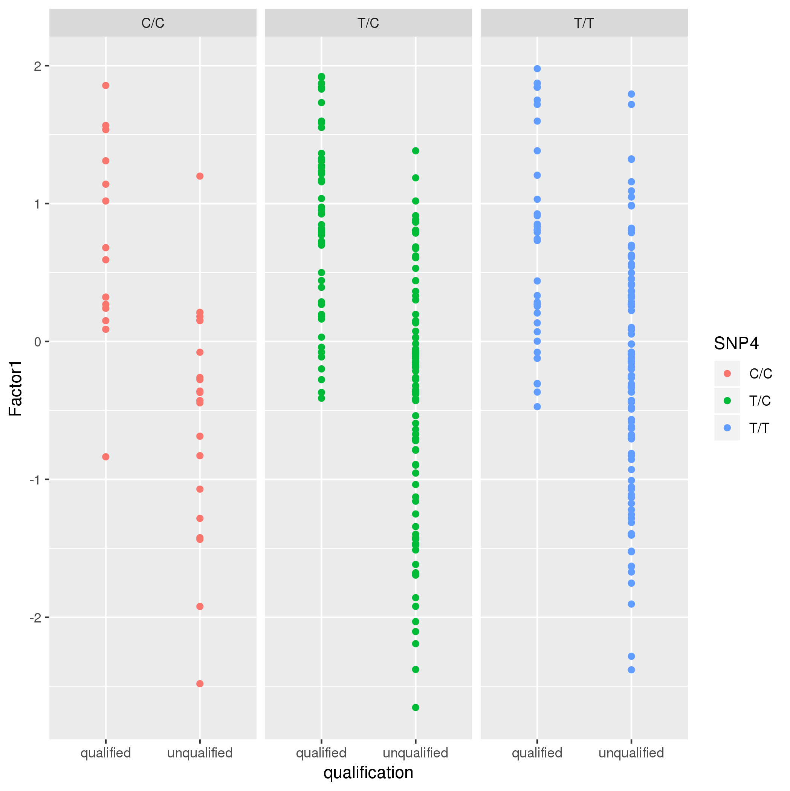

# Data summary by E. Somerville

## Overview of data

Data from: Effect of canine oxytocin receptor gene polymorphism on the successful training of drug detection dogs (Konno et al., 2018)
Access data: https://github.com/ericsomerville/BIOL4585_projects/raw/master/drug_dogs.csv
Overview: This study tested the hypothesis that genetic variation of the canine oxytocin receptor (OXTR) gene may regulate the success of a dog's training to become a drug detection dog. A significant effect of the OXTR genotype on the success of the dogs' training was found, with a higher proportion of dogs carrying the C allele (T/C and C/C genotypes) being successful candidates than dogs carrying the T/T genotype. Dog personality scores of Training Focus (Factor 1) were positively correlated with an increased likelihood that a dog would successfully complete training.

## Does OXTR Genotype correlated with training success? 

*Interpreation*: The data suggests a significant effect of the OXTR genotype on the result of a dog's training for drug detection, with a higher proportion of dog's carrying the C allele (i.e. T/C or C/C genotype) being successful than dogs carrying the T/T genotype.

## Q2: Does a dog's personality have an effect on a dog's training success?

*Interpreation*: During the 4 month training period, the training staff assessed each dog's personality for a number of traits that may impact its suitability for the work of drug detection. The data suggests that successful dogs tended to have higher levels of activity, interested in the "target" dummy, concentration, and independence. Boldness and friendliness scores did not have as clear of an impact on training success.

## Q3: How can factor scores predict training success for dogs with various OXTR genotypes?

*Interpreation*: This study calculated composite "factor" scores that combined a dog's scores for the personality traits. Factor 1 ("Training Focus") was based on concentration, interest in target, activity, and boldness. Factor 2 ("Tolerance") was based on friendliness to humans and tolerance to other dogs. The data suggests that higher Training Focus scores are associated with successfully trained dogs for all genotypes. The data in the second chart suggests that Tolerance score is not a reliable indicator of training success.

