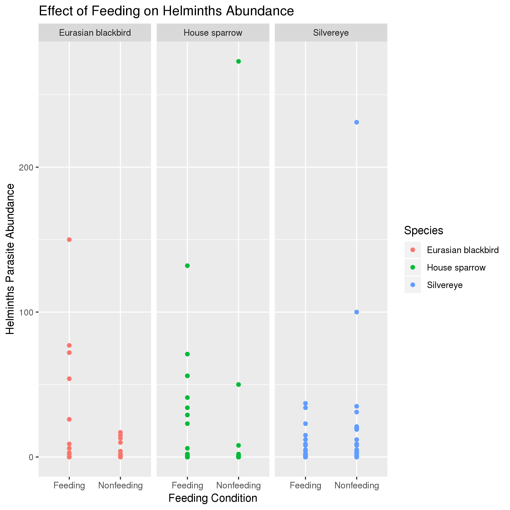
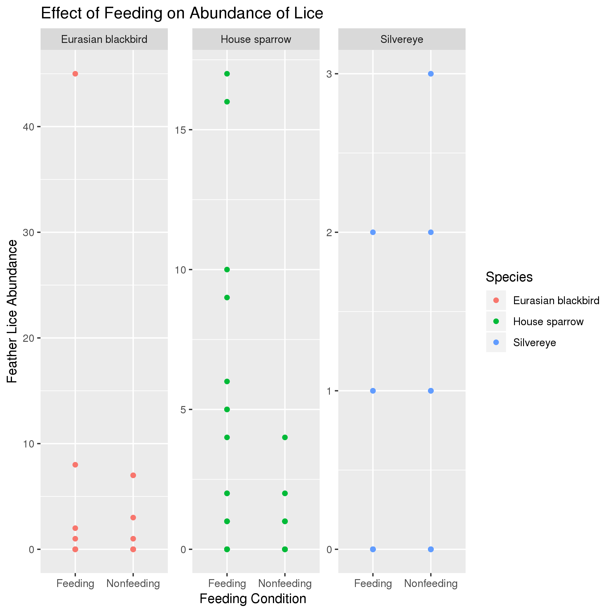
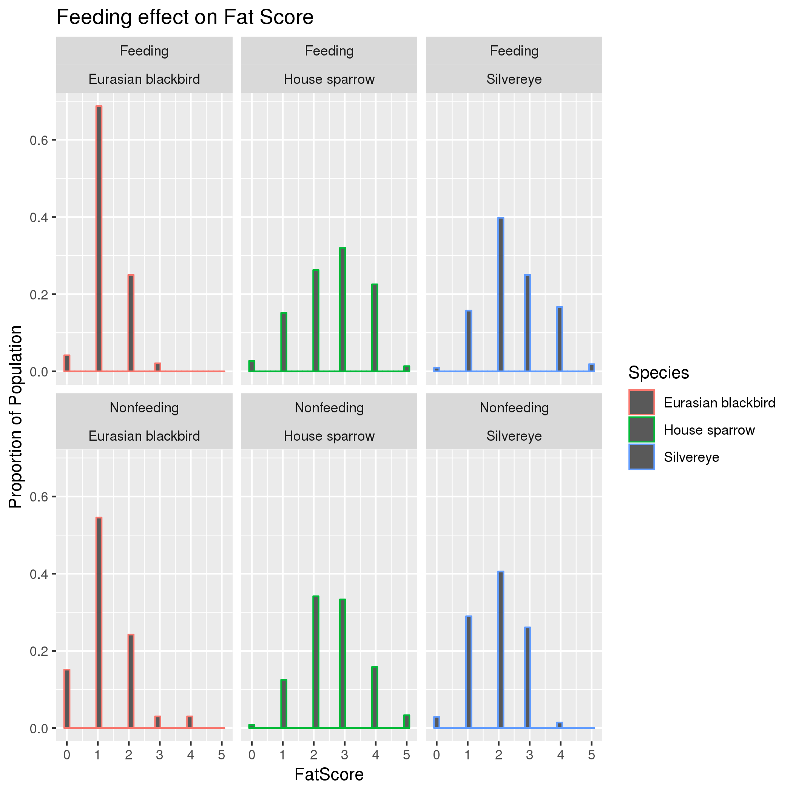

# Data summary by Ingrid Kenyon

## Overview of data
I used data from https://datadryad.org/bitstream/handle/10255/dryad.130367/Galbraith%20et%20al%202016%20JAB.csv which describes disease data for various populations of birds.

## Q1: Does Feeding Affect the Abundance of the Helminths Parasite?

*Interpretation*: This plot shows that for Eurasian Blackbirds and House Sparrows, birds that were captured near feeders had a higher abundance of the Helminths parasite compared to those that were not near feeders. Silvereye show the opposite trend, where those not around feeders had a higher parasite abundance.

## Q2: Does Feeding Affect the Abundance of Feather Lice?

*Interpretation*: This plot shows that the feeding condition of the birds was related to the abundance of lice but only in House Sparrows. Sparrows near feeders had a higher abundance of lice compared to non-feeders.

## Q3: Does Feeding Affect Body Condition?

*Interpretation*: The data show that Silvereye found near feeders had a higher fat content than those that were not around feeders. The feeding condition did not seem to affect fat content in either of the other species. 
