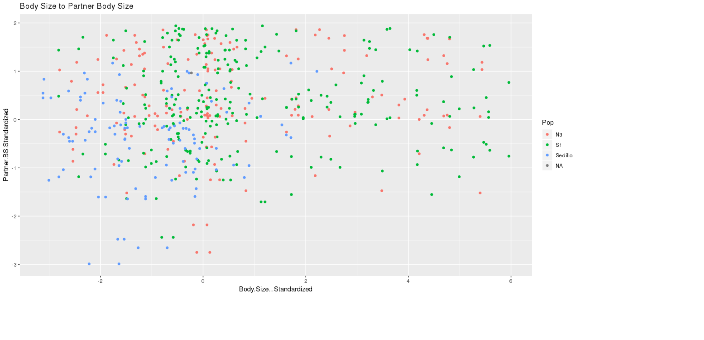
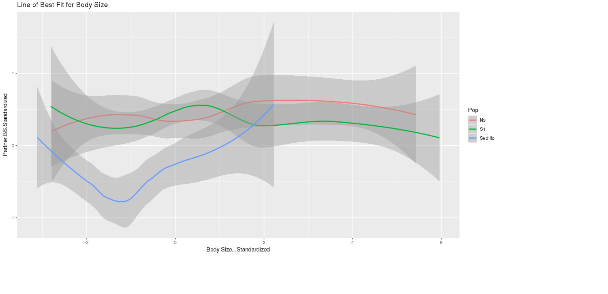
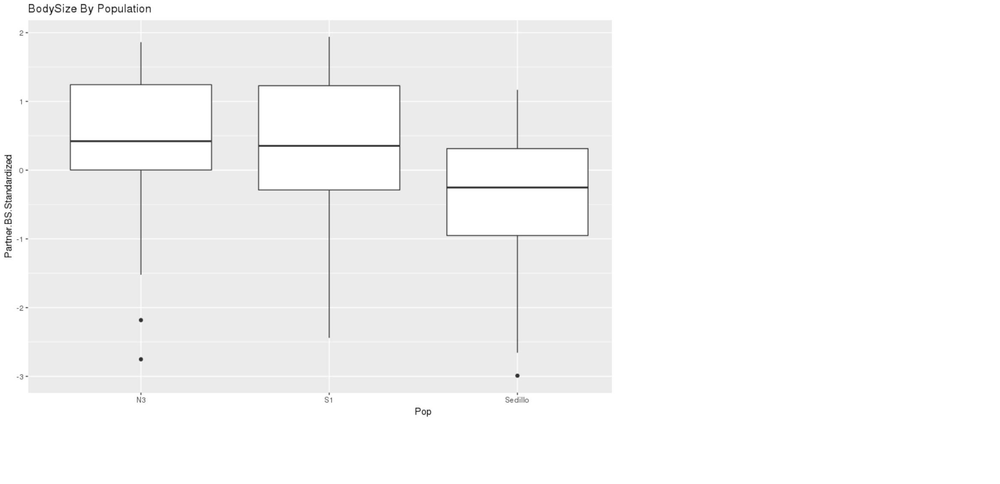
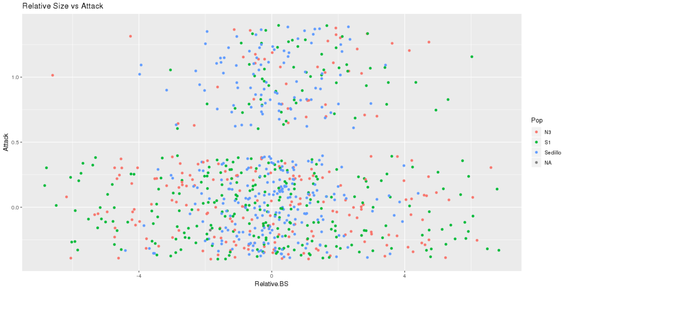
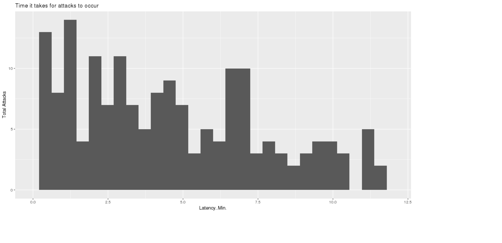

# Data summary - John Dunne

When searching for an interesting and worthwhile data set I thought to myself, "What topic is relevant to humans and has likely touched the reader or someone known to the reader?" The answer is obvious...the big "C", cannibalism. We all know someone who has struggled with cannibalism and hopefully these insights gleaned from some salt of the earth isopods bring some solace to you, the reader.

## Overview of data
I used data from https://datadryad.org/bitstream/handle/10255/dryad.44873/dryad%20data%20sharing.xlsx?sequence=1 which contains the following columns, Individual, Population, Sex, Dorsal Length, Dorsal width, Ventral length, Ventral width, Unique Identifier, Partner, Partner sex, Body size (PC1), Relative BS, Trial #, Start of trial, end of trial, Latency, Attack, Gaurd, Latency-trans, Body Size Standardized, Partner BS Standardized.  The organisms used for this experiment are Socorro isopod (Thermosphaeroma thermophilum) which are freshwater isopods native to New Mexico.

## Q1: Does body size correlate in anyway with the body size of the partner?

There does not seem to be any clear correlation between the body size of the individual and the body size of its partner. What we can see based upon the coloring of the populations however is that the original Sedillo population has smaller body sizes overall compared to the different lab colonies. Maybe using a line of best fit for each colonies will confirm this.

Clearly the Sedillo population is smalled than the southern and northern populations. The southern and northern populations interestingly enough almost seem to be mirror images of one another. Let us just see what a boxplot of the bodysize per population show us.

Now on to the cannabalism, enough body shaming of the natives.

## Q2:  Does relative body size correlate with attacks?

The lower half of the graph are the individuals who did not experience an attack (Attack = 0), while the top half of the graph is occupied by individuals who experienced an attack (Attack = 1). What we see here is that cannibalism does not occur between every couple but when it does occur it tends to be between couples who tend to be the same size (Relative BS closer to 0). There are only a few outliers to this observation with northern and southern populations, with these attacks occurring when the individual is larger than its partner.

## Q3: Of the trials which concluded with attacks, what times did the attacks occur?

A note: The trials officially ended at 12 minutes and 45 seconds, so these trials were excluded from the histogram.

What we can see from this histogram is that the vast majority (~75%) of attacks occurred before 7.5 minutes, and ~60% of the attacks occurring before 6 minutes. It appears that the cues associated with the cannibalization of a partner occur relatively quickly and are near immediate. Taken with the fact that the minority of trials ended with an attack suggests that exposure time might not be an important factor overall and that cannibalization occurs as a result of factors related to a physical factor between the pairs.

## Citations

Bleakley BH, Welter SM, McCauley-Cole K, Shuster SM, Moore AJ (2013) Cannibalism as an interacting phenotype: pre-cannibalistic aggression is influenced by social partners in the endangered Socorro isopod (Thermosphaeroma thermophilum). Journal of Evolutionary Biology 26(4): 832–842. https://doi.org/10.1111/jeb.12098

Data Package:

Bleakley BH, Welter SM, McCauley-Cole K, Shuster SM, Moore AJ (2013) Data from: Cannibalism as an interacting phenotype: pre-cannibalistic aggression is influenced by social partners in the endangered Socorro isopod (Thermosphaeroma thermophilum). Dryad Digital Repository. https://doi.org/10.5061/dryad.5h51p
