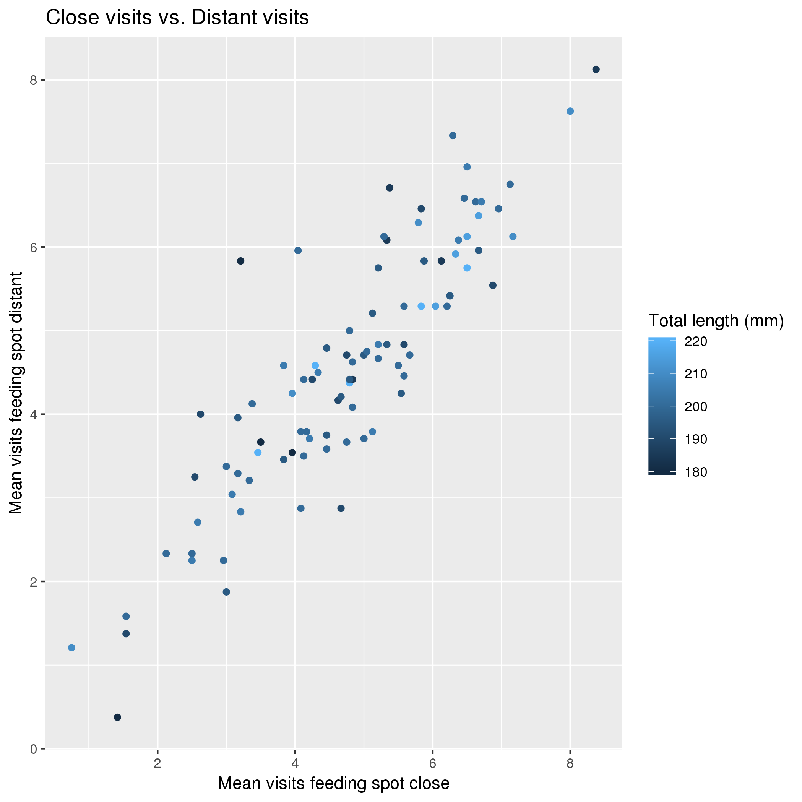
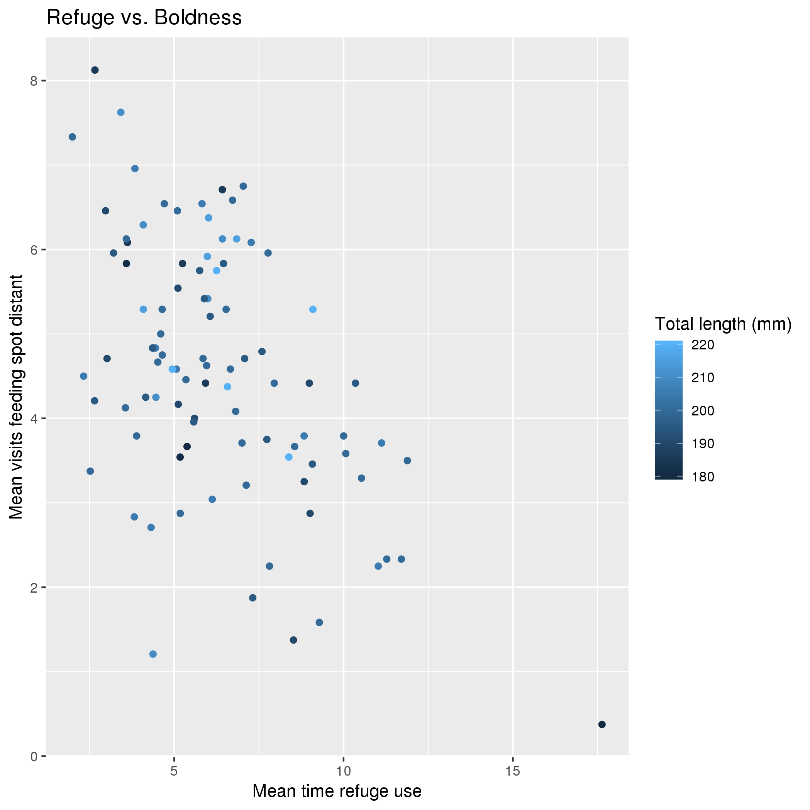
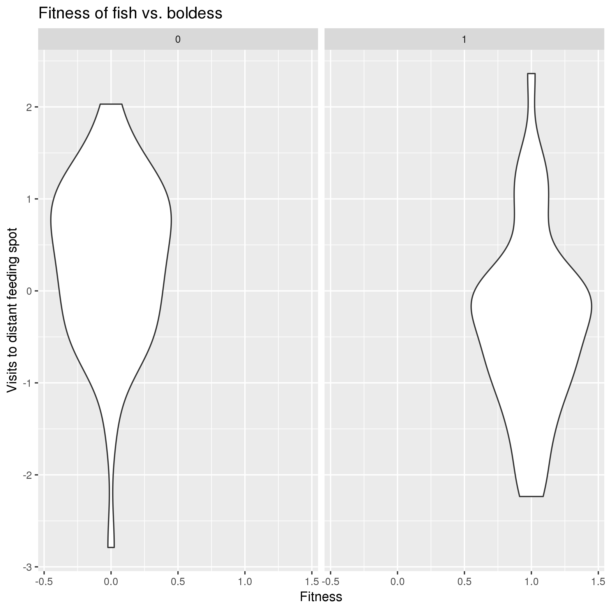

Data Summary by Joseph Outten

## Overview of data
I used data from https://datadryad.org/resource/doi:10.5061/dryad.qj163 which was used in the paper located at https://onlinelibrary.wiley.com/doi/full/10.1111/eva.12504. This describes different traits of fish (especially size, boldness, and growth) in an attempt to describe the selection seen on boldness in angling fishing.

## Question 1: Does boldness at one site imply boldness at another?

*Interpretation*: The data shows a strong and positive correlation between visits at a close site and visits at a far site. This implys that little information is lost when usign one variable over another and that both measurements may not have been necessary.

## Question 2: Does the time spent in the refuge correlate with the visits at the distant feeding spot?

*Interpretation*: The data shows that there is a clear negative correltation between time spent at the refuge and the number of visits to the further feeding spot. This means that time spent at one was taking away from time spent at another. 

## Question 3: Does the boldness of fish affect fitness?

*Interpretation*: The data shows that the boldness of the fish (measured in terms of how many visits were made to the further feeding spot) does have a weak implication in a lowerv fitness. The bowing put of the violin plot is flipped for high fitness (1) and low fitness (0).
