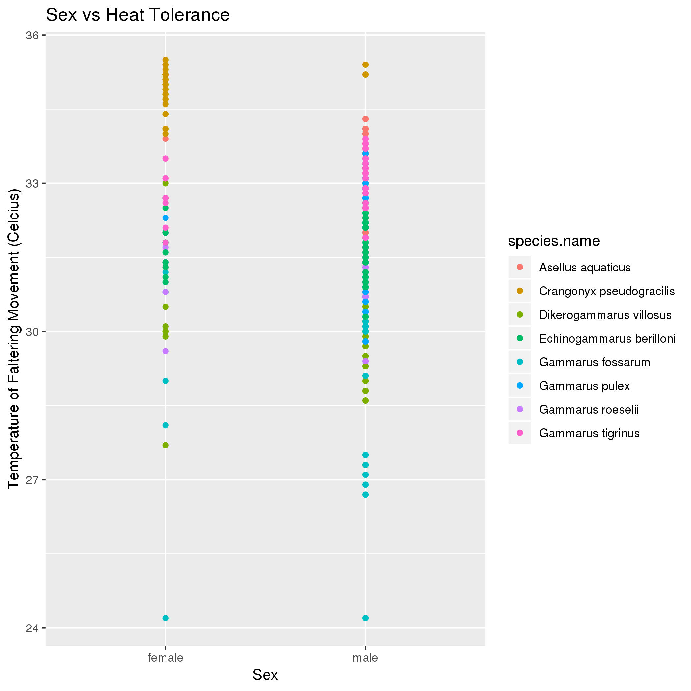
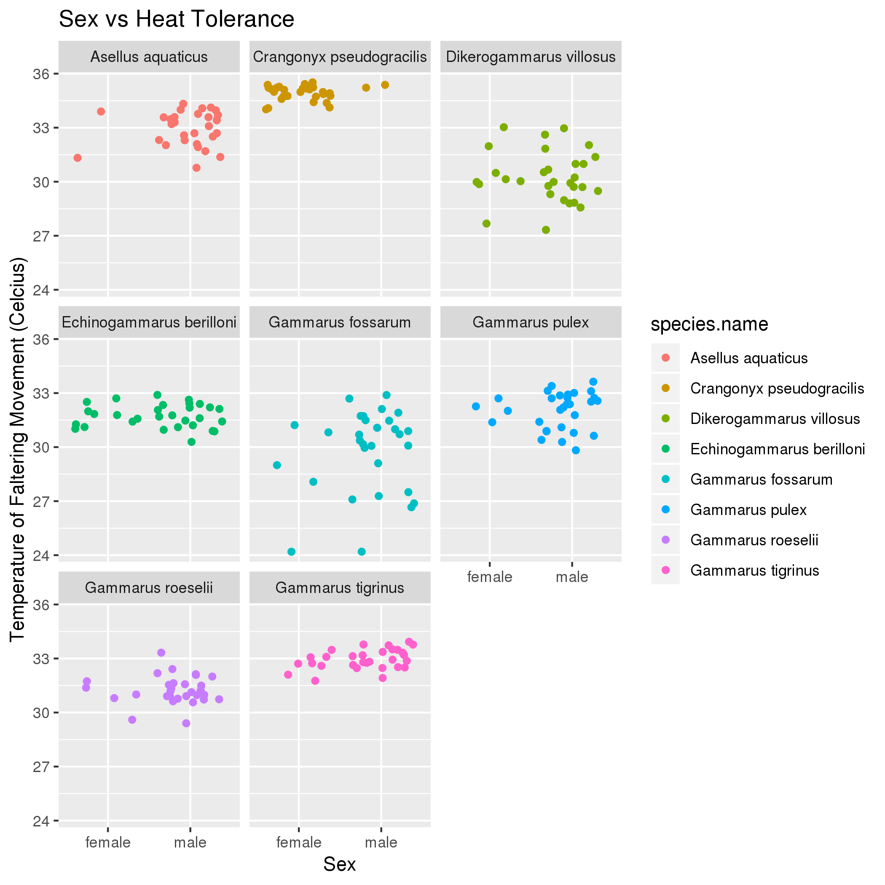
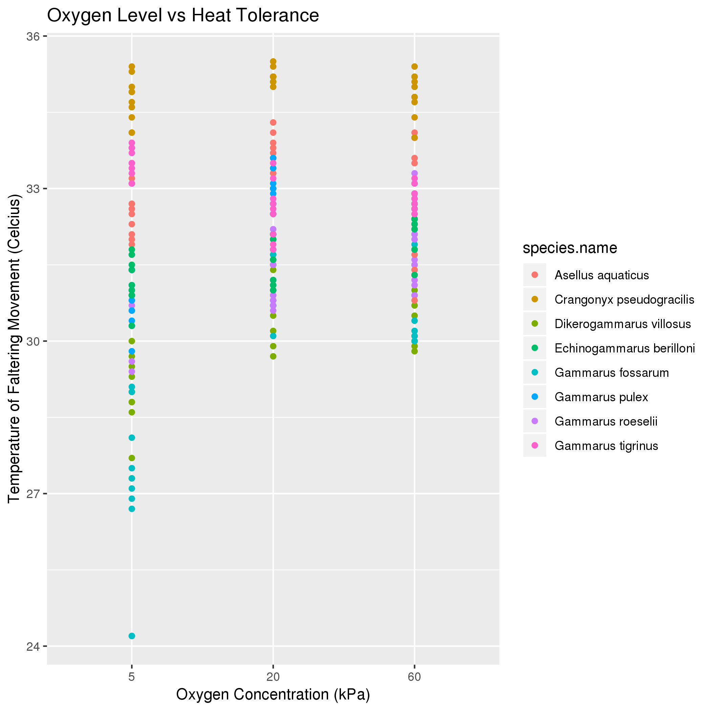
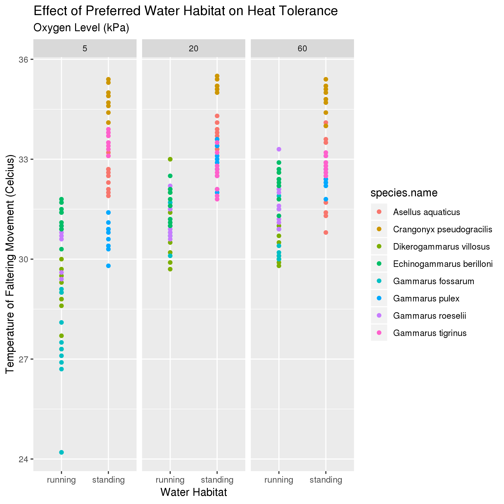

# Data summary by Karl Keat

## Overview of data
I used data from https://datadryad.org/bitstream/handle/10255/dryad.168233/FE_datfile_TTolerance.csv which describes the heat tolerance of different crustaceans. The dataset contains data on the heat tolerance of multiple species of crustaceans at varying oxygen conditions (hypoxic, normal, and hyperoxic).

## Q1: Does sex correlate with heat tolerance?

*Interpretation*: At first glance, the data appears to imply that female crustaceans have a higher overall heat tolerance than male ones. However, when you facet the data by species, a different trend emerges.

Within species, there does not appear to be significant variation between genders in heat tolerance. Furthermore, it appears that for some species, there is a significant skew towards one gender in the observed population. This means that the variation in heat tolerance is probably a result of variation between the species.

## Q2: Does heat tolerance vary with oxygen level?

*Interpretation*: There appears to be a small overall increase in heat tolerance between hypoxic (5kPa) and normal (20kPa) oxygen conditions, with some variation in effect between species. The trend is less clear between normal and hyperoxic (60kPa) conditions. This seems to imply that in general, a lack of oxygen reduces crustaceans' ability to resist other stressors such as high heat more than an overabundance of oxygen does.

## Q3: Does water habitat type affect heat tolerance?

*Interpretation*: Based on the data, there's a clear trend towards standing water crustaceans having a higher heat tolerance across all oxygen levels. Furthermore, the running water crustaceans became far more heat sensitive in response to hypoxic conditions compared to standing water crustaceans. 
