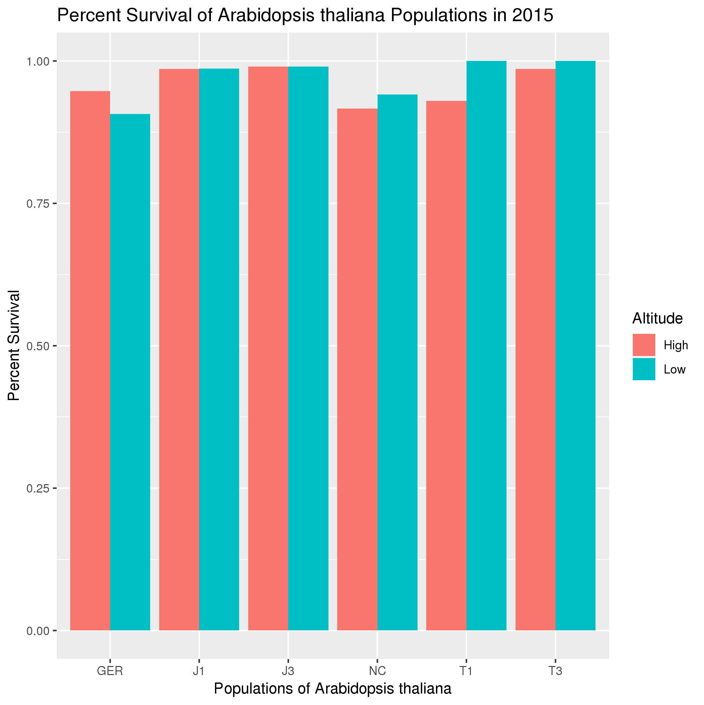
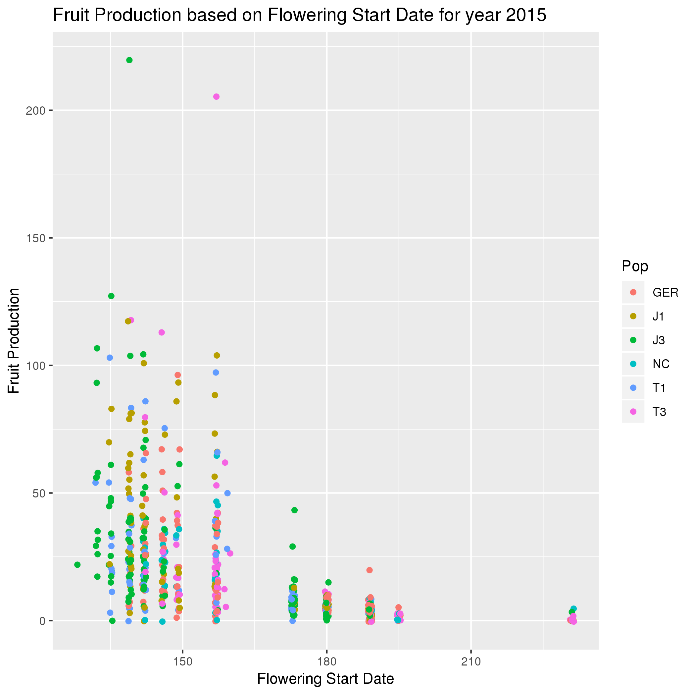
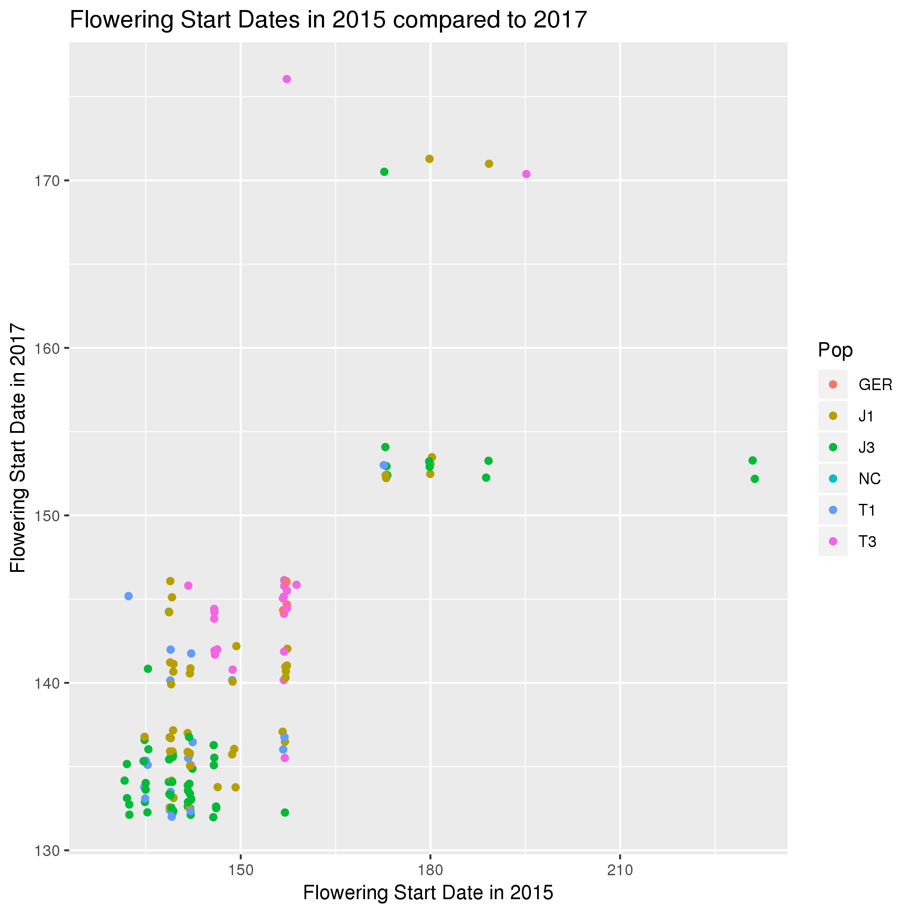

# Data summary by Katharine Biegert

## Overview of data
I used data from https://datadryad.org/resource/doi:10.5061/dryad.3gc6nj6/1 and https://datadryad.org/resource/doi:10.5061/dryad.3gc6nj6/2 using
```
wget https://datadryad.org/bitstream/handle/10255/dryad.179231/Low_phenotypes.txt
wget https://datadryad.org/bitstream/handle/10255/dryad.179232/High_phenotypes.txt
```
which describes Individual Identifier, Population, Seed Family, Planting Block, Survival, Flowering Propensity, Fruit Production, and Flowering Start date for Arabidopsis thaliana populations. Data was given at high and low altitudes during the years 2015, 2016, and 2017.

## To get into R
```
module load gcc
module load R/3.5.1
R
library("gglot2")
library("data.table")
```
##Importing the data sets into R and converting it to a data.table object
```
LowPheno <- fread('Low_phenotypes.txt')
HighPheno <- fread('High_phenotypes.txt')
```
I wanted to merge these two data sets in order to compare the high and low altitude conditions to each other more easily. In order to do this I added a new column to both data sets called "Altitude" and set the value to "Low" for the LowPheno data set and "High" for the HighPheno data set.
```
LowPheno[, Altitude := "Low"]
HighPheno[, Altitude := "High"]
Phenos <- rbindlist(list(LowPheno, HighPheno))
```
This created a new data set called "Phenos" which I worked with to answer my subsequent questions.

## Q1: Does the percent survival of the Arabidopsis thaliana populations vary at high and low altitude in the year 2015?

The data sets I used coded the survivability of the individuals as either a 0 for they did not survive, or 1 for they did. I converted this to percent survivability using Cory's help. The code below shows how to take the sum of all the rows which had Surv_15 = 1 (survivors) divided by the total number of individuals, whether they survived or not.
```
ggplot(Phenos[, list("PercentSurvival"=sum(Surv_15==1, na.rm=T)/.N, .N), by=list(Altitude,Pop)], aes(x = Pop, y = PercentSurvival, fill = Altitude)) + geom_bar(stat="identity", position="dodge") + xlab("Populations of Arabidopsis thaliana") + ylab("Percent Survival") + ggtitle("Percent Survival of Arabidopsis thaliana Populations in 2015")
```



*Interpreation*: The data show that the NC, T1, and T3 Arabidopsis thaliana populations survived better at the low altitude. The J1 and J3 populations survived equally as well as at the high and low altitudes. The GER population was the only one that survived better at high altitude. Overall, the J1 and J3 populations had the highest survival rates. All for the year 2015.

## Q2: Does an earlier Flowering Start Date correlate with higher Fruit Production in 2015?

The following code plots flowering start date against fruit production, it is colored based on Pop in order to show differences between populations.  
```
ggplot(Phenos, aes(x = Fstart_15, y = Fruits_15, color = Pop)) + geom_jitter() + xlab("Flowering Start Date") + ylab("Fruit Production") + ggtitle("Fruit Production based on Flowering Start Date for year 2015")
```



*Interpreation*: The data show that an earlier Flowering Start Date does appear to correlate with higher Fruit Production. Further statistical tests would be required to prove actual correlation. The J3 population is the earliest flowerer among the populations of Arabidopsis thaliana, and has high fruit production.

## Q3: Do Flowering Start Dates vary over time within populations?

The code below compares Flowering Start Dates in 2015 and 2017 compared across populations. In order to show population differences it was colored by Pop.

```
ggplot(Phenos, aes(x = Fstart_15, y = Fstart_17, color = Pop)) + geom_jitter() + xlab("Flowering Start Date in 2015") + ylab("Flowering Start Date in 2017") + ggtitle("Flowering Start Dates in 2015 compared to 2017")
```



*Interpreation*: The data show that, in general, Flowering Start Dates are earlier from year to year. Note that the Flowering Start Dates from 2015 to 2016 and 2016 to 2017 were compared as well, but only 2015 to 2017 was shown here for clarity as this graph showed the most distinct difference. The J3 population is the earliest flowerer in both 2015 and 2017.
