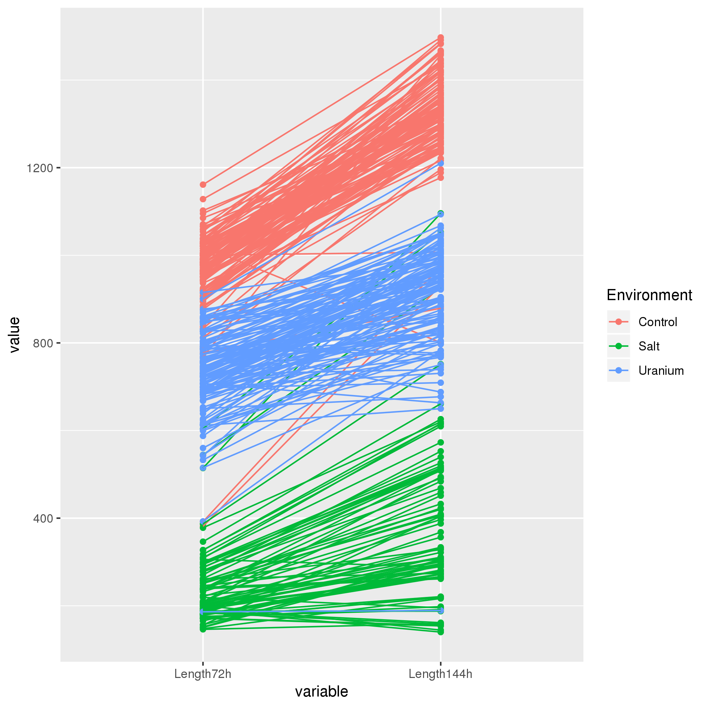
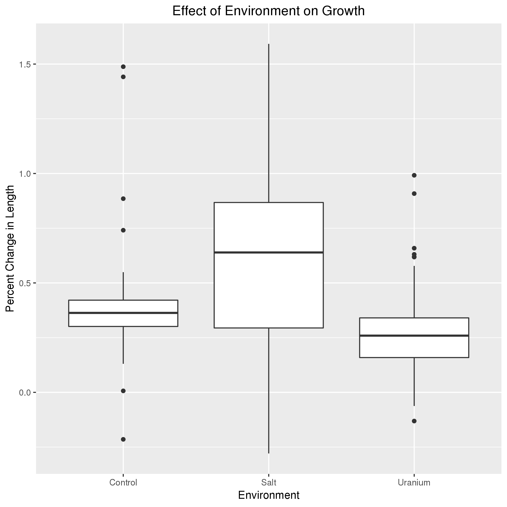
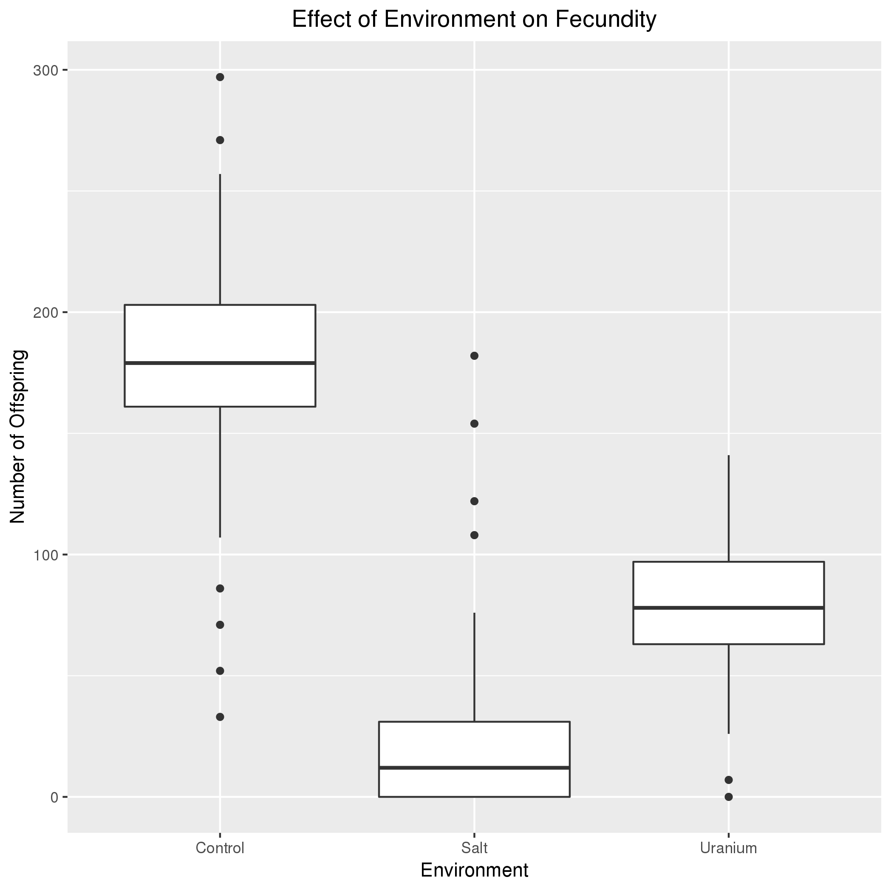
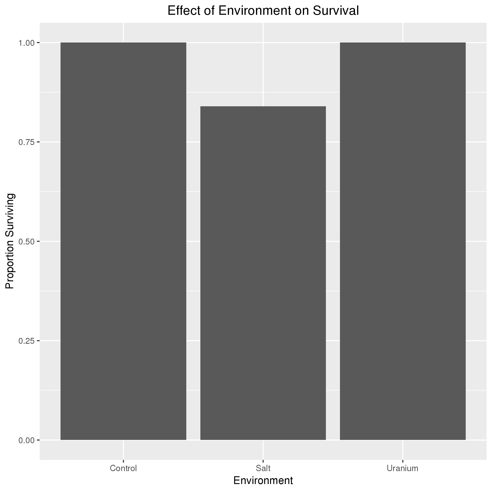

# Data summary by M. Hilzendeger

## Overview of data
I used data from https://datadryad.org/bitstream/handle/10255/dryad.78937/Lines_data.csv which describes the effect of different environments on life history traits for a population of the nematode C. elegans.

## Q1: Does the environment effect growth?

*Interpretation*: The data show that uranium slightly reduces growth while high salt concentrations greatly increases the spread of changes in growth among the population.

## Q2: Does the environment affect the fecundity of C. elegans?

*Interpretation*: The data show that the environmental conditions tested do not significantly affect the fecundity of C. elegans.

## Q3: Does the enviornment affect survival of C. elegans?

*Interpretation*: The data show that while uranium did not affect survival, high salt concentrations significantly reduced survival of C. elegans.
