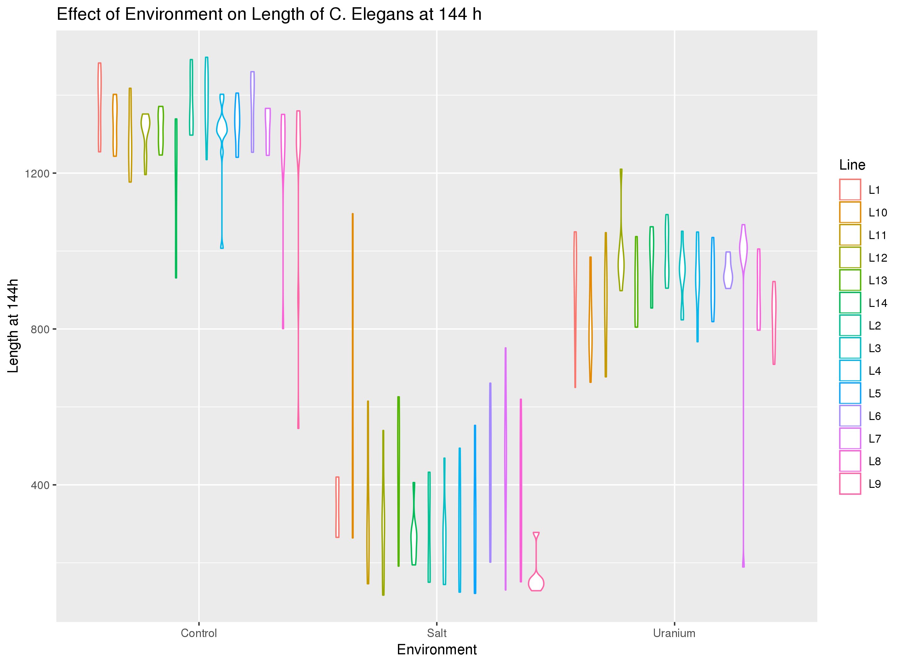
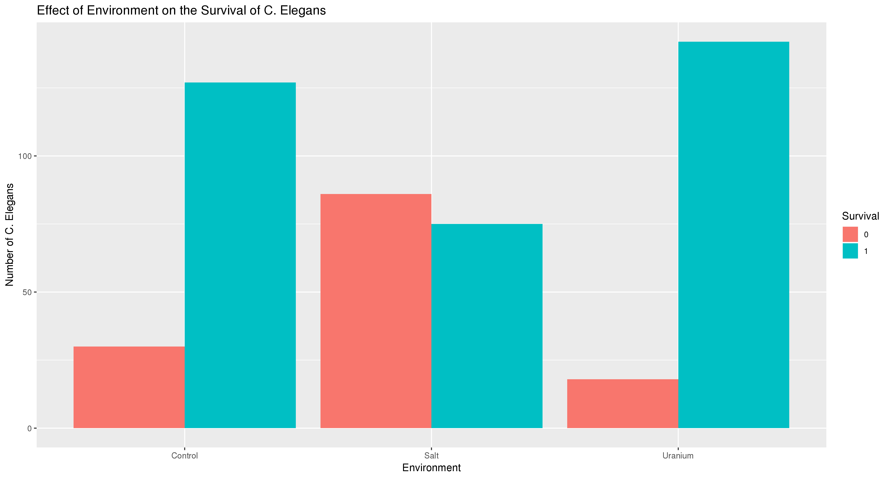
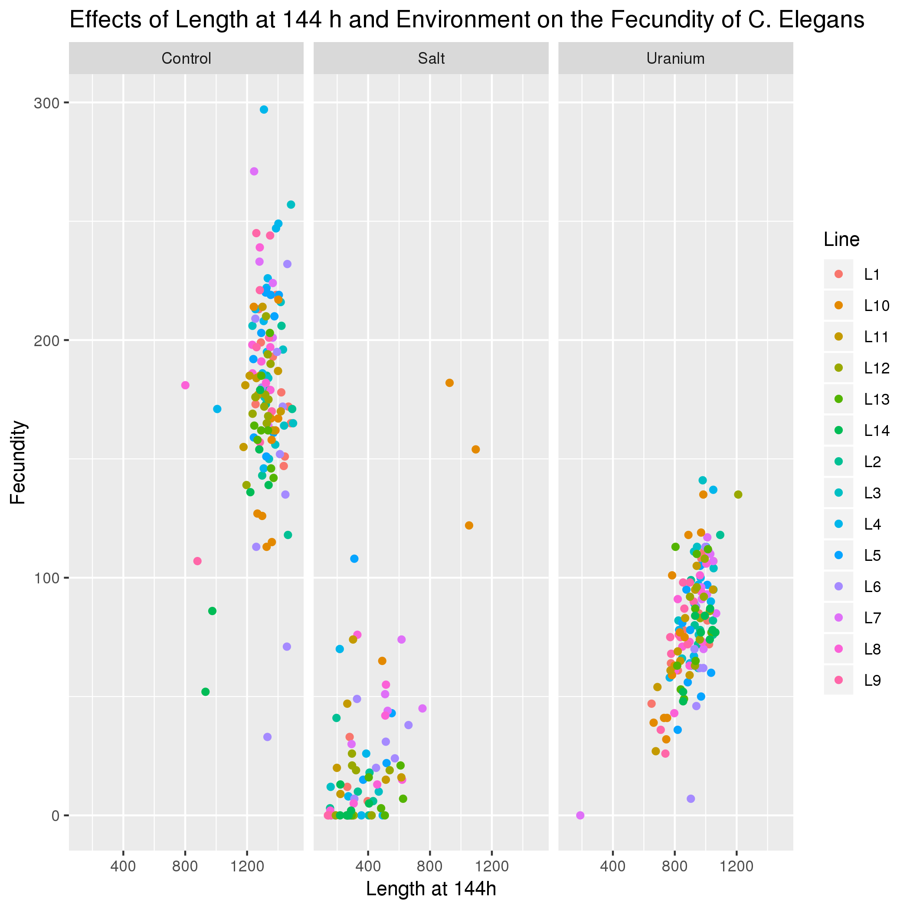

# Data summary by Sarah Hunderup

## Overview of data
I downloaded data from https://datadryad.org/bitstream/handle/10255/dryad.78937/Lines_data.csv through
```
wget https://datadryad.org/bitstream/handle/10255/dryad.78937/Lines_data.csv
```
This gives me the data that describes the Line, Environment, Fecundity, Length at 72h, Length at 144h, and Survival of C. Elegans.
In order to move into R, you must follow:
```
module load gcc
module load R/3.5.1
R
library(data.table)
library(ggplot2)
```
Once in R, the data from Bash must be moved into a temporary variable in R via
```
Lines_data <- fread('Lines_data.csv')
```
## Q1: Does the Length at 144h vary depending on the Environment?


This graph is created by
```
gg1 <- ggplot(Lines_data, aes(x = factor(Environment), y = `Length (144h)`, col = Line)) + geom_violin() + xlab("Environment") + ylab("Length at 144h") + ggtitle("Effect of Environment on Length of C. Elegans at 144 h")
ggsave('Question_1.png', gg1)
```
*Reasoning behind Coding*: I wanted to see the data with the different lengths of the C. Elegans in the Environments. Coloring them based on the line will say they have the same genotype so they don't vary in genetics. The Violin plot allows the data to be separated by the lines and see if there's a difference between the lines and the Environment to see if either led to changes in lengths of the C. Elegans. It deleted all of the data of the worms that didn't survive.

*Interpreation*: The data shows that the C. Elegans length did correlate with the Environment they were grown in. They overall grew the longest in the control environment, the shortest in the salt Environment, and a middle length in the Uranium Environment. The lines did not seem to have a huge impact on the length, but line 10 did seem to have higher lengths and line 9 had lower lengths.

## Q2: Does the Survival of the worms depend on the Environment?


This graph is created by
```
Survival <- Lines_data[ , .N, by = list(Environment, Survival)][!is.na(Survival)]
gg2 <- ggplot(Survival, aes(x = factor(Environment), y = N, fill = factor(Survival))) + geom_bar(stat = "identity", position = "dodge") + xlab("Environment") + ylab("Number of C. Elegans") + guides(fill = guide_legend(title="Survival")) + ggtitle("Effect of Environment on the Survival of C. Elegans")
ggsave('Question_2.png', gg2)
```
*Reasoning behind Coding*: First, I wanted to get a count of how many survived vs how many died in each Environment. I also removed the NA data so that it was either one or the other and had it replace the original Survival column in my data. With the new data, I was then able to plot it as a bar graph, having the counts of those that survived and those that died next to each other per Environment to see if there was any correlation between the two.

*Interpreation*: The data shows that there did seem to be a correlation in the Environment with the survival rates of the C. Elegans. With 0 meaning the C. Elegans died and 1 meaning they survived, the Uranium had the lowest number of deaths with the greatest survival rates, with less than 25 dying. The control still had a large ratio of survival to death (about 1:5). The salt environment actually had a greater amount of C. Elegans that died than survived though it was close to 1:1 ratio. This shows that C. Elegans do not survive well in salt but they do in Uranium and the control group.

## Q3: Does the Fecundity depend on the size at 144h and the Environment?


This graph is created by
```
gg3 <- ggplot(Lines_data, aes(x = `Length (144h)`,  y = Fecundity, col = Line)) + geom_point() + facet_wrap(~Environment) + xlab("Length at 144h") + ylab("Fecundity") + ggtitle("Effects of Length at 144 h and Environment on the Fecundity of C. Elegans")
ggsave('Question_3.png', gg3)
```
*Reasoning behind Coding*: I want to be able to see the data of Fecundity with 2 variable effects, so I broke them up by environment grown and then how long they were to see if there were any patterns seen. The break was done through facet wrap in order to put 3 different plots side by side per environment. Then the length was the x variable with Fecundity was the y. Comparing the Y value with the X values or across the different environments allowed a further understanding of the relations.

*Interpreation*: The data shows that, in general, the increased length is correlated to the Fecundity of the worms. The length was also correlated with the Environment as seen in the first question, so that also could have had an effect on the Fecundity of the C. Elegans. However, when there were outliers in the length, it correlated more in the fecundity than the actual Environment.
